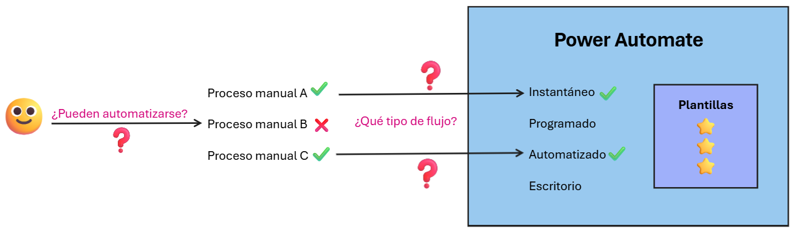
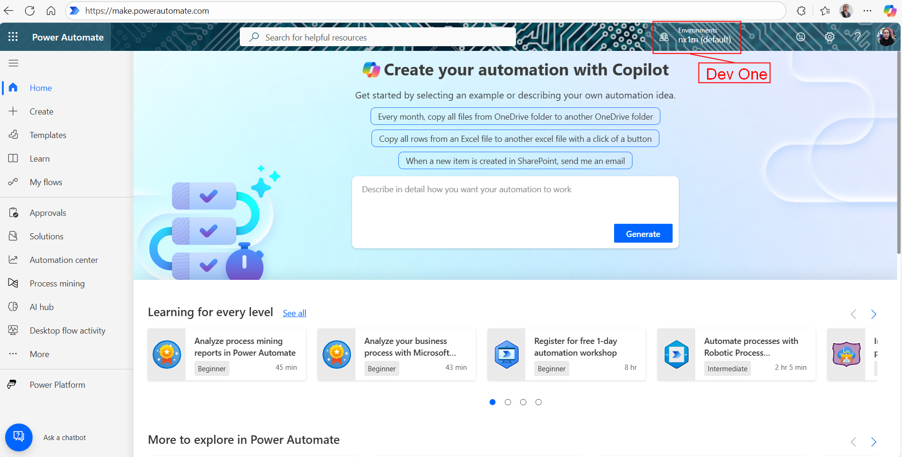

# Práctica 1.1. Ejercicios de análisis de procesos manuales que se pueden automatizar

## Objetivos
Al finalizar la práctica, serás capaz de:
- Identificar los procesos manuales que pueden automatizarse.
- Identificar los tipos de flujos que deberán usarse para cada caso de uso.
- Encontrar las plantillas adecuadas para cada situación.

## Duración aproximada
- 30 minutos.

## Objetivo visual

## Instrucciones 
Power Automate es una herramienta de la suite de Microsoft que permite crear flujos de trabajo automatizados entre aplicaciones y servicios. Su objetivo principal es reducir tareas repetitivas, mejorar la productividad y facilitar la integración de procesos dentro de la organización. Con Power Automate se pueden crear flujos sencillos, como recibir notificaciones automáticas, hasta procesos más complejos, como aprobaciones, integración con bases de datos o conexión con herramientas externas.

En este laboratorio, realizarás actividades enfocadas en el análisis de procesos manuales para identificar cuáles son viables de automatizar y cuáles requieren necesariamente la intervención humana. A partir de los casos de uso planteados, reflexionarás sobre qué tipo de flujo de Power Automate se debe utilizar en cada situación (por ejemplo, flujos automatizados, instantáneos o programados), reconociendo sus beneficios y limitaciones.

### Tarea 1. Identificar procesos automatizables

**Paso 1.** Analiza cada escenario.

A continuación, se plantearán cinco procesos; analizarás cuáles pueden ser automatizables y cuáles descartar. Usa lo visto en clase para realizar este filtro.

1. Aprobación de PECOS de compra: un usuario envía la solicitud de compra por correo y un responsable la aprueba respondiendo al mensaje.

2. Elaboración de documentos de análisis de impacto de aplicaciones (AIA): los analistas deben evaluar riesgos, dependencias, criticidad de aplicaciones y documentarlo.

3. Mantenimiento de bases de datos (reconstrucción de índices, validación de consumo de recursos): el DBA ejecuta _scripts_ y analiza métricas para decidir acciones.

4. Gestión de accesos (agregar miembros a grupos de red): el área de TI recibe solicitudes de acceso por correo y agrega usuarios manualmente a grupos de Active Directory.

5. Registro de solicitudes de proyectos: los usuarios envían un correo o llenan un archivo de Excel para registrar proyectos nuevos.

**Paso 2.** Para cada escenario, reflexiona sobre estas preguntas.
- ¿El proceso es **repetitivo** u ocurre solo de forma ocasional?  
- ¿Depende de datos que ya están en sistemas digitales (correo, bases de datos, SharePoint, etcétera)?  
- ¿Requiere **aprobaciones formales** o pasos definidos?  
- ¿Se puede estructurar en una secuencia de pasos claros y digitales?  
- ¿Depende fuertemente de razonamiento humano, análisis de un experto o redacción personalizada?

**Paso 3.** Marca tu respuesta.
Escribe al lado de cada escenario si consideras que:  
- Sí, es automatizable. 
- No, no es automatizable.

**Paso 4.** Revisa la respuesta correcta

## Resultado esperado
A continuación, la clasificación final.

1. **Gestión de accesos: automatizable ✅.**
Este proceso es repetitivo, basado en una regla clara: cuando llega una solicitud de acceso, un usuario debe agregarse a un grupo específico. Power Automate dispone de conectores para Azure Active Directory y Microsoft 365 Groups, lo que permite automatizar tanto la solicitud como la aprobación y el alta en el grupo. Además, el flujo puede dejar evidencia en un registro (SharePoint/Excel) y notificar al solicitante, reduciendo errores manuales y tiempos de espera.

2. **Aprobación de compras (PECOS): automatizable ✅.**
Se trata de un flujo típico de aprobación: alguien envía una solicitud de compra, un responsable debe revisarla y aprobarla o rechazarla. Este escenario encaja perfectamente con los flujos de aprobación de Power Automate, que permiten configurar notificaciones, seguimiento, trazabilidad y registro de decisiones. Como las decisiones siguen reglas organizacionales predefinidas y se basan en información estructurada (formularios, correos, datos en SharePoint/ERP), la automatización reduce tiempos y centraliza la información.  

3. **Reportería manual en Excel: automatizable ✅.**
Consolidar datos y generar reportes es un proceso altamente repetitivo y basado en datos estructurados. Si actualmente alguien descarga, copia y pega información en un Excel cada semana para luego enviarlo por correo, Power Automate puede automatizarlo programando la extracción de datos (desde SharePoint, SQL o un archivo de OneDrive), actualizar una plantilla y distribuirla automáticamente. De esta forma, se elimina la tarea mecánica y se asegura que la información llegue de forma puntual y consistente.

4. **Atención de tickets en Diagnostic Room: no automatizable completamente ❌.**
Aunque Power Automate puede ayudar a registrar tickets y notificar a los equipos, la asignación de especialistas requiere evaluar disponibilidad en tiempo real, conocimiento técnico y contexto del caso. Esto implica juicio humano, priorización y coordinación que no pueden reducirse a reglas simples. El flujo puede apoyar con pasos iniciales (registro del ticket, notificación a un grupo, clasificación básica), pero la decisión final sobre a quién asignar siempre debe ser humana.

5. **Planes de continuidad (BCP): no automatizable ❌.**
Elaborar y actualizar un plan de continuidad requiere análisis estratégico, visión organizacional y redacción experta. No es un proceso repetitivo ni basado en datos que un flujo pueda manipular de forma mecánica. Power Automate podría facilitar tareas periféricas, como recolectar insumos de distintas áreas o enviar recordatorios para actualizar documentos, pero la construcción del plan y la toma de decisiones críticas no son automatizables. Por eso, este caso de uso se clasifica como no automatizable dentro de Power Automate.

---

### Tarea 2. Seleccionar el tipo de flujo
**Paso 1.** Ahora que has identificado qué procesos pueden ser automatizables y cuáles no, procederás a seleccionar el tipo de flujo de Power Automate que servirá para cada caso. Para esto ingresa a [Power Automate](https://make.powerautomate.com).

**Paso 2.** Abre el navegador e ingresa a [Power Automate](https://make.powerautomate.com), con las credenciales otorgadas por el instructor. Asegúrate de seleccionar el entorno **Dev One** en el costado superior derecho.

**Paso 3.** Para ayudar a identificar el tipo de flujo, usarás Copilot. Power Platform te permite usar Copilot con la integración en las interfaces de Power Automate, Power Apps y Copilot Studio (Antes Power Virtual Agents). 

Para esto, prueba los siguientes prompts y espera la sugerencia de Copilot. 

Haz clic en la caja de texto del medio donde te solicita describir la automatización. 

**Paso 4.** Ingresa el siguiente prompt para el proceso de **gestión de accesos**.

`Crea un flujo automatizado que se ejecute cuando reciba una solicitud en Microsoft Forms. El flujo debe validar la información del usuario (correo electrónico) y luego agregarlo automáticamente a un grupo de seguridad en Azure AD. Finalmente, envía un correo de confirmación al solicitante y al área de TI con los detalles del cambio.`

Deberías recibir una o varias sugerencias de flujos. Si recibes varias sugerencias, desplázate por cada una de ellas en el costado inferior donde dice **Version 1 of _n_**, haciendo clic en las flechas.

**Paso 5.** ¿Qué tipo de flujo identificaste? 
Así es, como las acciones se desencadenarán a partir de un evento externo, se considera un ***flujo automatizado***.

**Paso 6.** Descarta los cambios, por el momento no vas crear el flujo. 

**Paso 7.** Repite los pasos del ***4 al 6***, utilizando los siguientes prompts para definir el tipo de flujo para los dos procesos restantes.

**Aprobación de compras (PECOS)**

`Crea un flujo que se ejecute al recibir un correo en Outlook con el asunto "Confirmación de PO". El flujo debe extraer el asunto del correo y agregarlo a un archivo de Excel alojado en SharePoint. Después, envía una notificación a Microsoft Teams al equipo de compras confirmando la actualización del Excel.`

**Reportería manual en Excel**

`Crea un flujo recurrente que se ejecute cada lunes a las 8:00 a.m. El flujo debe extraer datos de un informe en Power BI, exportarlo a Excel o PDF y enviarlo automáticamente por correo electrónico a un grupo de distribución. Incluye un mensaje personalizado en el cuerpo del correo con la fecha del reporte generado.`

**Paso 8.** ¿Qué tipos de flujo identificaste? 
¡Así es! la aprobación de compras (PECOS), de la misma manera que el primer proceso, también se considera como un ***flujo de nube automatizado***, dado que se desencadena por un evento externo. Sin embargo, el proceso de reportería manual en Excel, es un ***flujo de nube programado***, debido a que el desencadenador está basado en el tiempo.

---

### Tarea 3. Uso de plantillas
**Paso 1.** Ahora que has identificado qué procesos pueden ser automatizables y cuáles no, además del tipo de flujo de Power Automate que servirá para cada caso con ayuda de Copilot, finalizarás viendo el uso de las plantillas. Para esto, ingresarás nuevamente a [Power Automate](https://make.powerautomate.com). 

**Paso 2.** Abre el navegador e ingresa a [Power Automate](https://make.powerautomate.com) con las credenciales otorgadas por el instructor. Asegúrate de seleccionar el entorno **Dev One** en el costado superior derecho.

**Paso 3.** Selecciona la opción ***Templates*** del menú en el costado izquierdo. Si están plegadas las opciones y no lo ves, haz clic en el ícono de las tres líneas horizontales que se encuentra en el costado superior izquierdo, sobre ***Home*** .

**Paso 4.** En esta página aparecerán todas las plantillas predefinidas que puedes usar para ahorrar tiempo y en cada ***Card***, menciona tanto el nombre, como el propietario y el ***tipo de flujo***. 
Filtra por tipo de flujo de nube e inspecciona el resultado:
* `Instant`
* `Automated`
* `Schedule`

Valida cuál ***template*** usarías para los procesos de estudio en este laboratorio o para uno en específico de tu día a día. 

### Resultado esperado
Finalmente, deberías ver el despliegue de la plantilla que escogiste y los conectores que están involucrados para el _trigger_ y las acciones. 

