# Práctica 1.2. Creación de un flujo básico a intermedio: automatización de un proceso de aprobación

## Objetivos
Al finalizar la práctica, serás capaz de:
- Conocer la interfaz de Power Automate.
- Crear un flujo básico desde cero.
- Elaborar un flujo de aprobación desde una plantilla y ejecutarla desde una aplicación Canvas de Power Apps.

## Duración aproximada
- 40 minutos.

## Objetivo visual

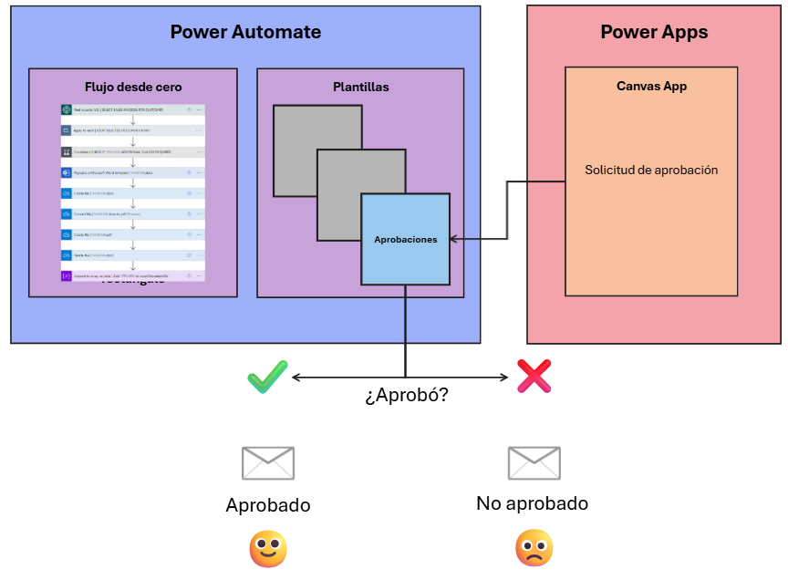

## Instrucciones 

En Power Automate es posible crear flujos de manera flexible: desde construirlos completamente desde cero, definiendo paso a paso los conectores, desencadenadores y acciones, hasta aprovechar plantillas predefinidas que aceleran el desarrollo y permiten iniciar un flujo a partir de aplicaciones como Power Apps, facilitando la integración con otros servicios de Microsoft 365. 

En este laboratorio, aprenderás a conocer la interfaz de Power Automate, crear un flujo básico desde cero y utilizar una plantilla para diseñar un flujo de aprobación que se pueda ejecutar desde una aplicación Canvas en Power Apps, conectando ambos entornos de manera práctica.

### Tarea 1. Crear un flujo de Power Automate desde cero

Imagina que trabajas para una empresa de logística que recibe diariamente correos electrónicos de sus proveedores con documentos adjuntos como facturas, guías de despacho y certificados de entrega. Estos archivos deben almacenarse de manera ordenada en OneDrive para facilitar su consulta y auditoría, pero el proceso manual de abrir cada correo, descargar el archivo y guardarlo con un nombre adecuado consume tiempo y es propenso a errores. A menudo, los documentos se guardan con nombres genéricos o duplicados, lo que dificulta su identificación y seguimiento. Esta situación genera retrasos en la validación de pagos y en la conciliación de entregas, afectando la eficiencia operativa del equipo.

Para solucionar este problema, crearás un flujo automatizado desde cero. 

**Paso 1.** Ingresa a Power Automate.

Abre el navegador e ingresa a [Power Automate](https://make.powerautomate.com), con las credenciales otorgadas por el instructor. Asegúrate de seleccionar el entorno **Dev One** en el costado superior derecho.

**Paso 2.** Selecciona la opción ***Create*** del menú izquierdo y, en la sección, ***Start from Blank*** haz clic en ***Automated cloud flow***.

**Paso 3.** Esto abrirá una nueva ventana donde te solicitará el nombre del flujo que crearás y el desencadenador que usarás. 

Agrega los siguientes datos:
- **Flow name:** `Guardar adjuntos con timestamp`.
- **Choose your flow's trigger:** `When a new email arrives (V3)` .

> [!NOTE]
> Asegúrate elegir el trigger del conector Office 365 Outlook, en lugar de Outlook.com

Haz clic en el botón **Create**.

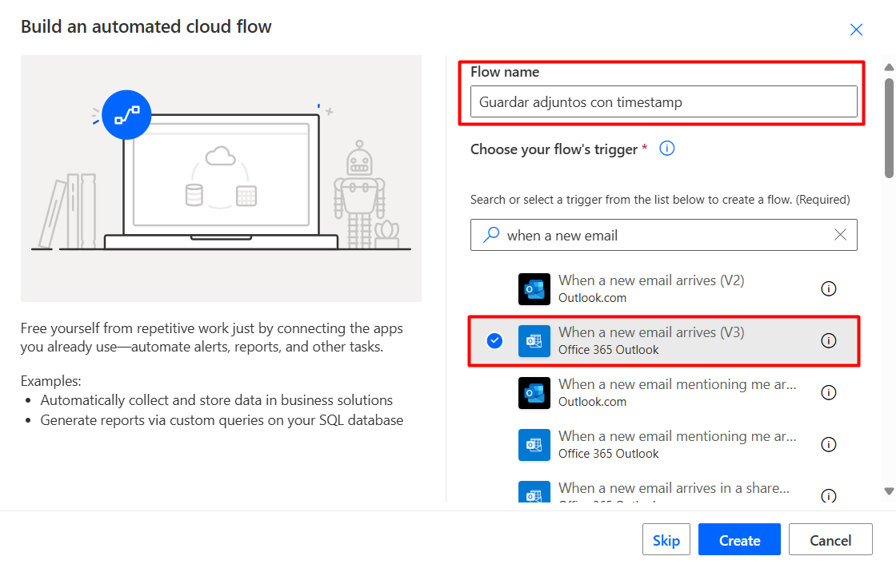

**Paso 4.** Ya que estás en el diseñador de flujos de Power Automate, iniciarás la creación de tu flujo.

Te debe de aparecer el desencadenador, ahora agrega un nuevo paso. Haz clic en la cruz que está bajo el recuadro del conector desencadenador. En la ventana emergente filtra por la acción ***Apply to Each*** del conector ***Control*** y haz clic sobre este. 

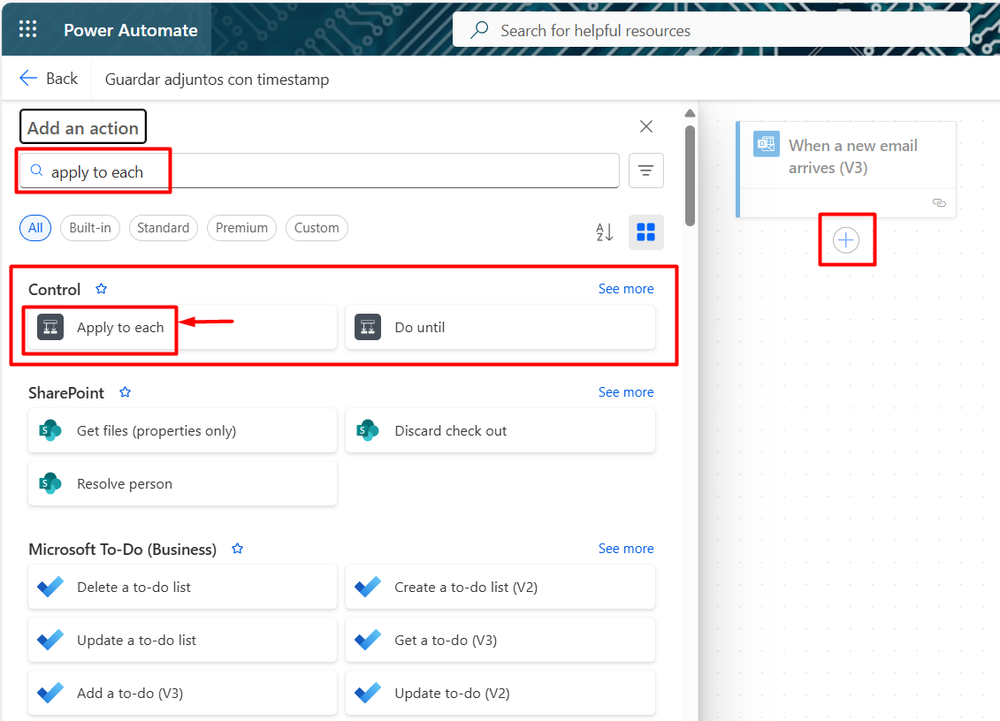

**Paso 5.** En la ventana que te solicita los parámetros, selecciona el ícono del rayo que representa el contenido dinámico y, a continuación, haz clic en ***Attachments***. 

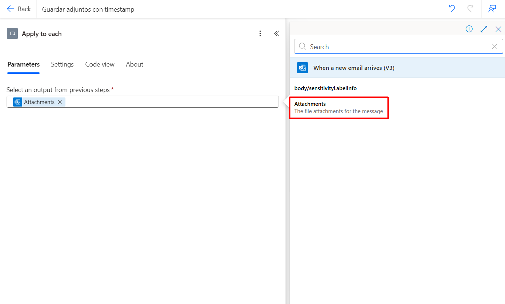

**Paso 6.** Haz clic en la cruz que está en el centro de la acción ***Apply to each*** del lienzo, en la ventana que se abre, busca la acción ***create file*** del conector ***One Drive for Business*** y haz clic en ella.

**Paso 7.** En la ventana del paso ***Create File*** Configura `/` como el ***Folder Path***. En el ***File Name*** en lugar de dejar solo el nombre original, inserta una expresión que agregue la fecha y hora al nombre. Haz clic en el icono `fx` (expresión). 

Escribe la siguiente expresión y confirma con **Add**.

`concat(formatDateTime(triggerOutputs()?['headers']['Date'], 'yyyyMMdd_HHmmss'), '_', item()?['Name'])`

> [!TIP]
> * **triggerOutputs()?['headers']['Date']** → toma la fecha en que se recibió el correo.
> * **formatDateTime(..., 'yyyyMMdd_HHmmss')** → convierte esa fecha a un formato legible (año, mes, día, hora, minuto, segundo).
> * **item()?['Name']** → obtiene el nombre del archivo adjunto.
> * **concat(...)** → une ambas partes para crear un nombre único.

**Paso 8.** Asegúrate de que la expresión quede como **concat(...)** en el campo ***File Name***. En **File Content**, haz clic en el ícono del rayo que representa el contenido dinámico y en la ventana emergente selecciona ***Attachments Content***.

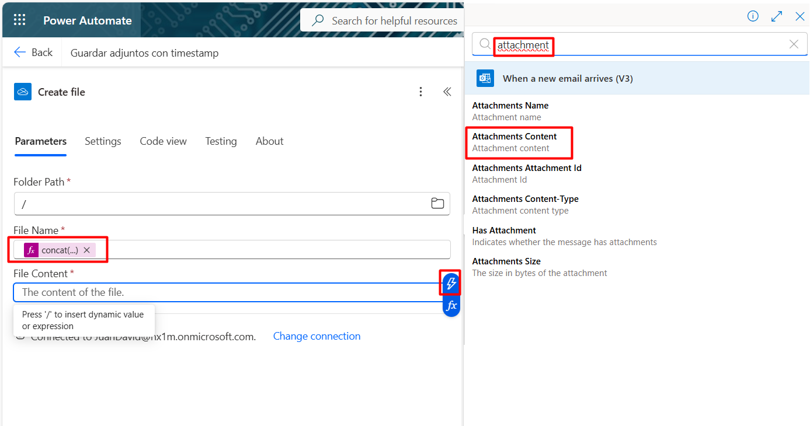

**Paso 9.** Haz clic en el botó ***Guardar***. 

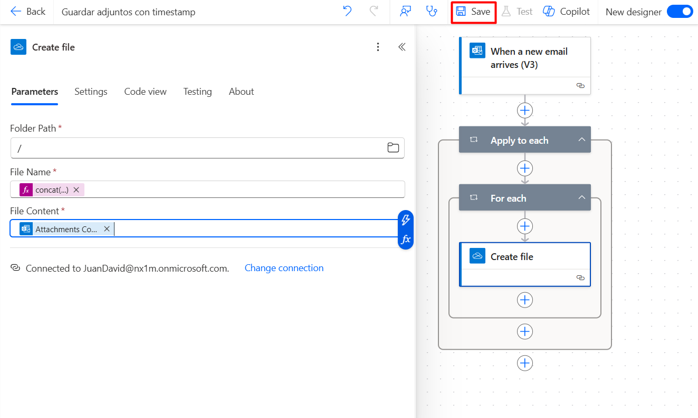

**Paso 10.** Envía un correo de prueba a tu cuenta con un archivo adjunto. Verifica en OneDrive que el archivo se guarde con un nombre como: ***20250924_203107_MonaLisa.jpg***

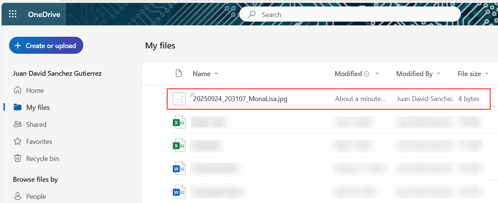

### Resultado esperado

Regresa a la ventana de tu flujo, haz clic en el botón **Back** del costado superior izquierdo. En la página de tu flujo, verifica que en el historial del correo haya un registro con estado ***Succeeded***.

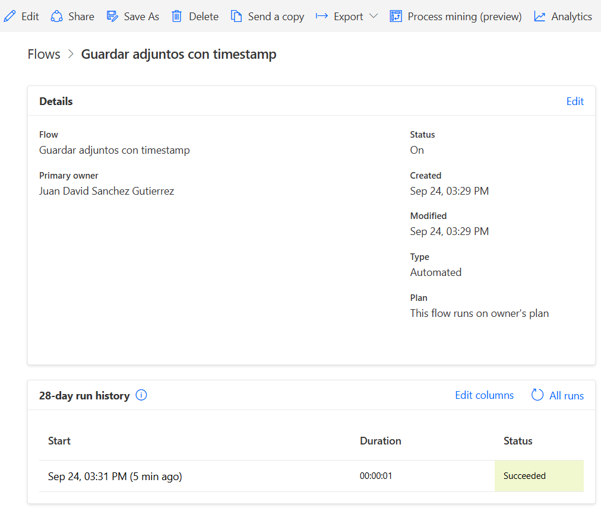

### Tarea 2. Crear una Canvas app que ejecute un flujo de aprobación

**Paso 1.** Ingresa a Power Apps

Abre el navegador e ingresa a [Power Apps](https://make.powerapps.com) con las credenciales otorgadas por el instructor. Asegúrate de seleccionar el entorno **Dev One** en el costado superior derecho.

**Paso 2.** Haz clic en la opción **Create** del menú izquierdo y, posteriormente, selecciona la tarjeta ***Start with a blank canvas***.

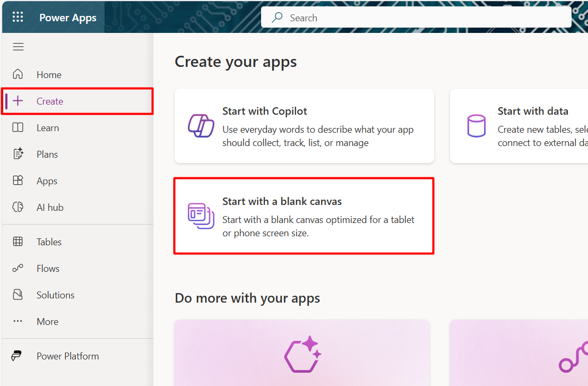

**Paso 3.** Selecciona la opción ***Phone size*** y espera que abra el Power Apps Studio, una vez adentro, cierra el mensaje de bienvenida.

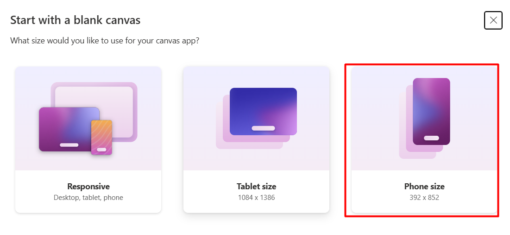

**Paso 4.** En el costado superior selecciona **Insertar** y los siguientes componentes:
- Etiqueta de texto.
- Entrada de texto.
- Botón.

Selecciona la etiqueta de texto, usa la combinación de teclas ***Ctrl+C*** y pegalo tres veces más en el lienzo con ***Ctrl+V***. Haz lo mismo con las Entrada de texto, sólo que en esta ocasión sólo las pegarás dos veces. 

Organiza la ubicación y el tamaño de los componentes de tal manera que se vean así:

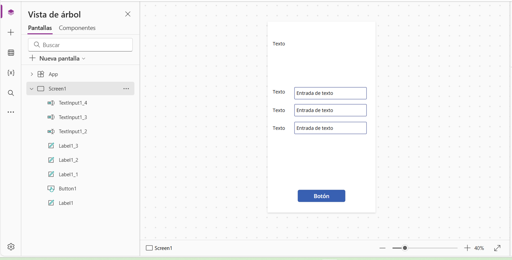

**Paso 5.** Modifica las Etiquetas de texto de la siguiente manera:

* La que quedó en la parte superior, cambiale el Texto a: `Aplicación de aprobación`, el Espesor de la fuenta a Negrita y la alineación de texto a Alinear al centro. 

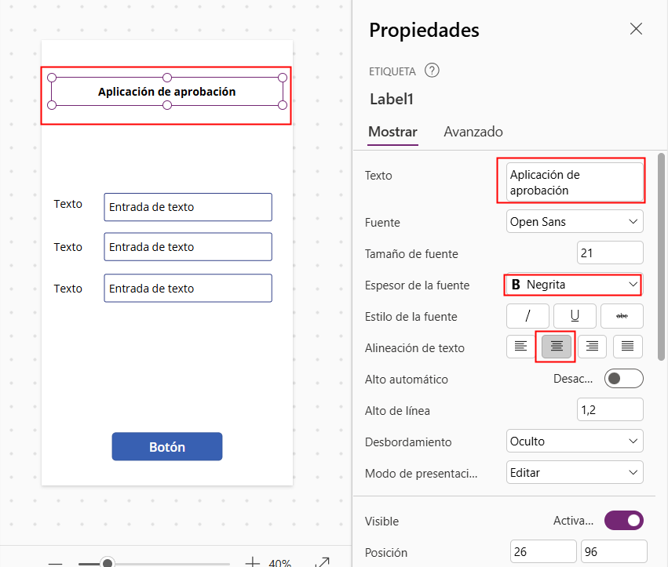

* Las demás etiquetas sólo debes modificar el Texto por: `Solicitante`, `Aprobador` y `Solicitud`. 

Finalmente, deberías tener tu aplicación de forma similar como se muestra en la imagen:

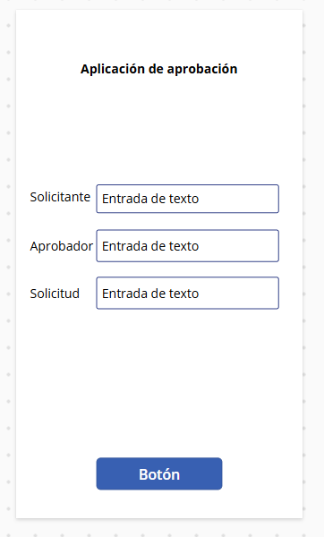

**Paso 6.** En el panel de la izquierda de tu aplicación haz clic en los tres puntos horizontales **...** y luego selecciona **Power Automate**. Posteriormente haz clic en el botón **Crear nuevo flujo**.

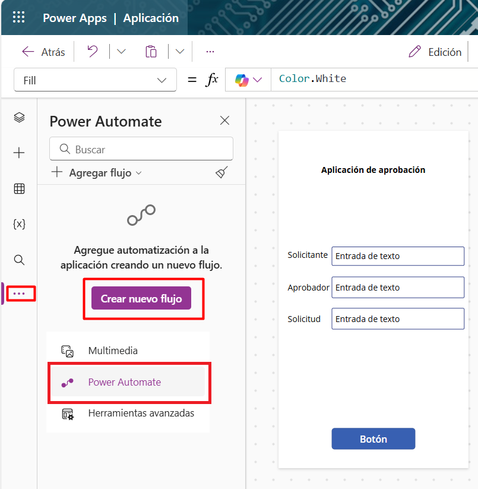

**Paso 7.** Aparecerán templates de Power Automate que pueden iniciarse desde Power Apps. Explora las diferentes plantillas que podrías usar y piensa en qué escenarios te servirían. 

Luego, busca el que tiene por nombre **Send approval and follow up via Teams** espera que se creen las conexiones a los conectores de ***Standard Approvals*** y ***Microsoft Teams*** y haz clic en Next. La última pantalla te dirá que los datos necesarios del flujo (***Title for your Approval***, ***Email address of the approver*** y ***Email address of the requester***) se extraerán de la aplicación, eso lo configuraremos en el siguiente paso. Haz clic en **Create flow**.

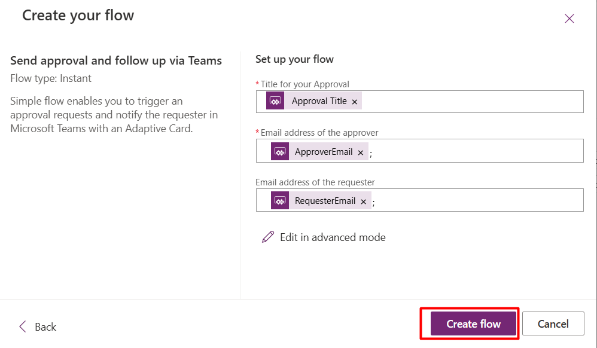

**Paso 8.** Ahora configuraremos el botón para enviar la solicitud. En tu lienzo selecciona el botón que creaste previamente. En la parte superior verás seleccionada la opción **OnSelect** y la función predeterminada ***false*** (El funcionamiento de las funciones en las Canvas Apps lo exploraremos en el siguiente capítulo del curso). Reemplaza la función predeterminada ***false*** por la siguiente: 

`SendapprovalandfollowupviaTeams.Run(TextInput1_3.Text;TextInput1_4.Text;TextInput1_2.Text)`

Esta función corre el flujo que creaste previamente y que tiene por nombre ***SendapprovalandfollowupviaTeams***. Si personalizaste el nombre en el paso anterior, debes intentar con el nombre que le pusiste. 

Dentro de la función están los siguientes datos como parámentos en el orden correspondiente: ***1. Caja de texto donde ingresarás el correo de quien hace la solicitud. 2. Caja de texto donde ingresarás el correo de quien aprobará. 3. Caja de texto donde ingresarás la solicitud***

**IMPORTANTE:** Valida que los nombres de las cajas de texto coincida, de lo contrario tu flujo fallará. 

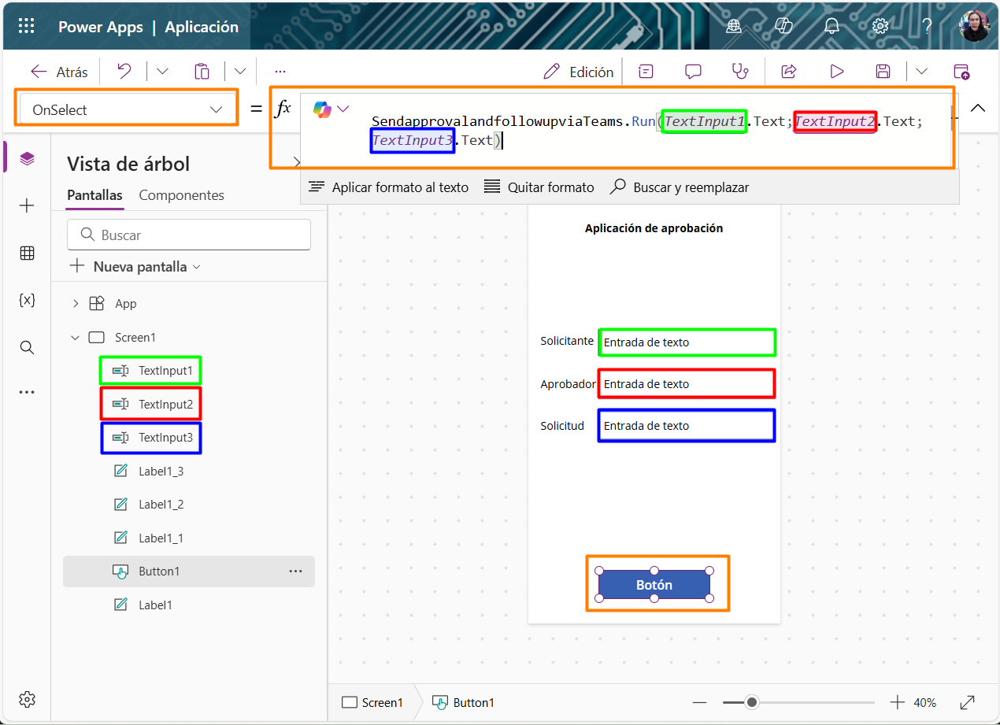

**Paso 9.** Una vez verificados todos los datos de tu aplicación, procederemos a probarla, para ello, primero guardala (El botón del costado superior derecho) y asígnale el nombre: `Paorbación App`. Luego haz clic en el botón triangular que se encuentra al lado izquierdo del botón de guardar. 

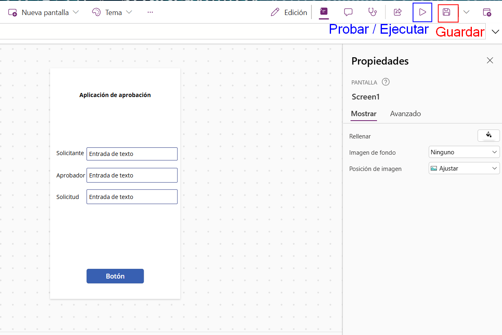

**Paso 10.** Ingresa los datos para enviar la aprobación, para efectos de ese ejemplo, el solicitante y el aprobador serás tú, es decir agrega el correo asignado por tu instructor en las dos secciones, y en la solicitud escribe: `Solicitud de Laptop`. Finalmente haz clic en tu botón. 

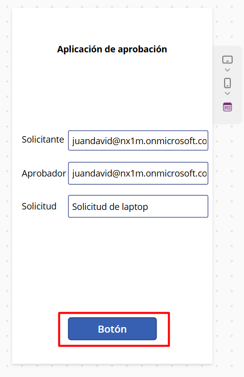

**Paso 12.** Ingresa a Power Automate

Abre el navegador e ingresa a [Power Automate](https://make.powerautomate.com) `https://make.powerautomate.com`. Usa las credenciales otordadas por el instructor. Asegurate de seleccionar el entorno **Dev One**, en el costado superior derecho.

**Paso 13.** En el menú izquierdo selecciona ***Approvals*** y verifica que tengas una nueva solicitud de aprobación, haz clic sobre el nombre de la aprobación **Solicitud de laptop**.

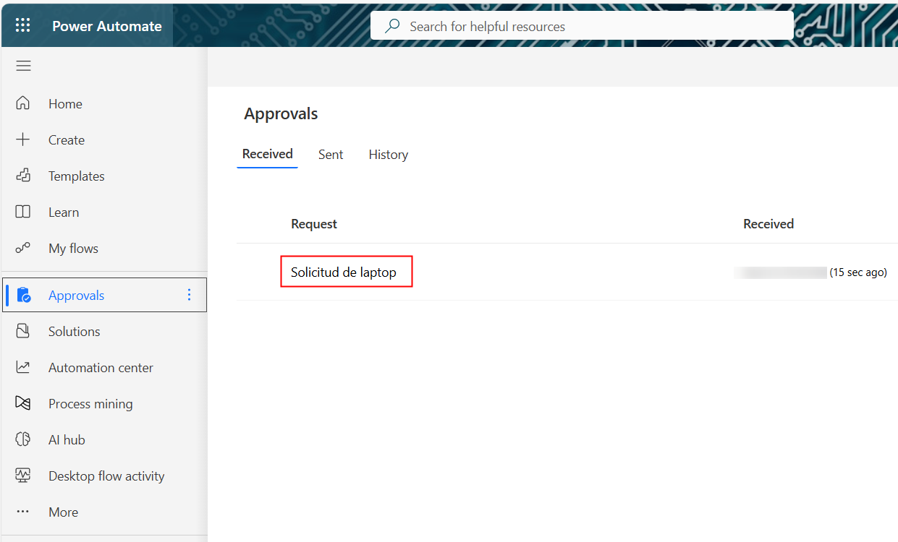

**Paso 14.** Selecciona la opción ***Approve*** para el campo **Choose your response** y agrega tus comentarios, por ejemplo: `La solicitud fue aprobada`, y haz clic en el botón **Confirm**.

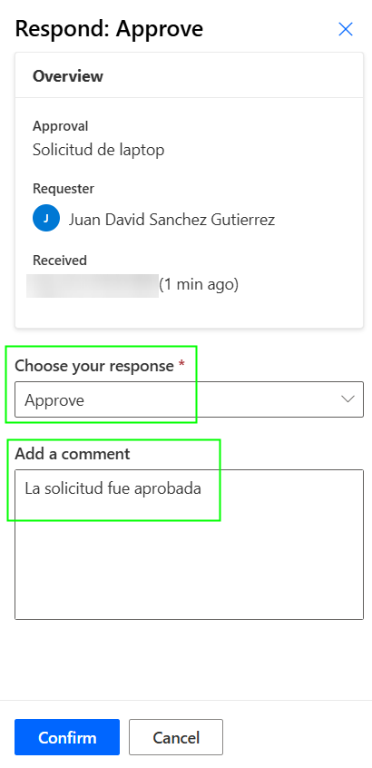

**Paso 15.** Desde el navegador ingresa a [Microsoft Teams](https://teams.microsoft.com/v2/) `https://teams.microsoft.com/v2/`. Verifica que tengas una notificación y un mensaje de chat del remitente ***Workflows***. En el chat se te confirma que tu solicitud fue aprobada. ¡Felicitaciones!

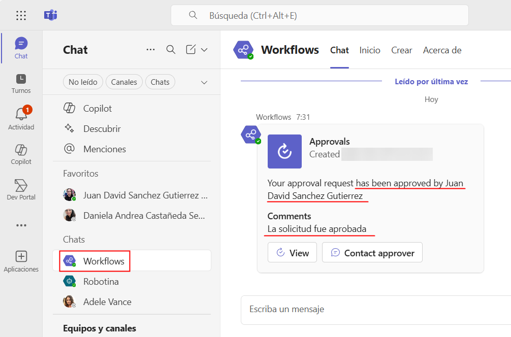

**Paso 16.** Finalmente vamos a verificar que el flujo se ejecutó correctamente, para ello, regresa a [Power Automate](https://make.powerautomate.com), selecciona la opción **My flows** del menú del costado izquierdo, y abre el flujo que acabas de crear:

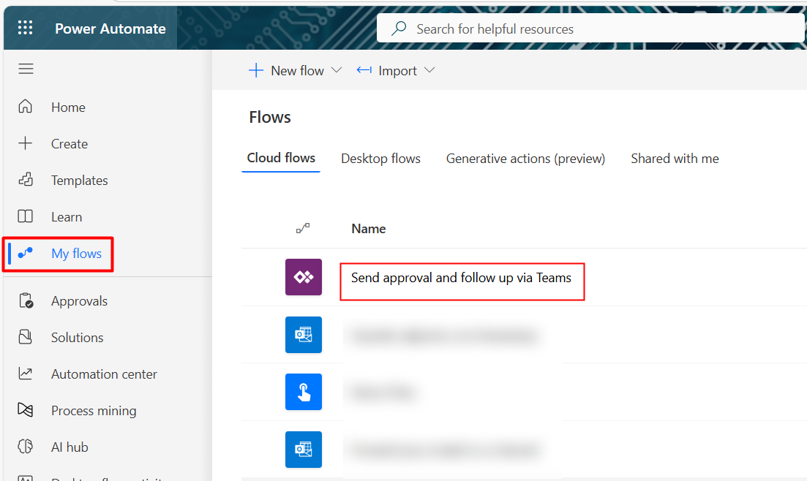

### Resultado esperado
Deberías ver la ejecución de tu flujo con la cantidad de tiempo y el estado ***Succeeded***.

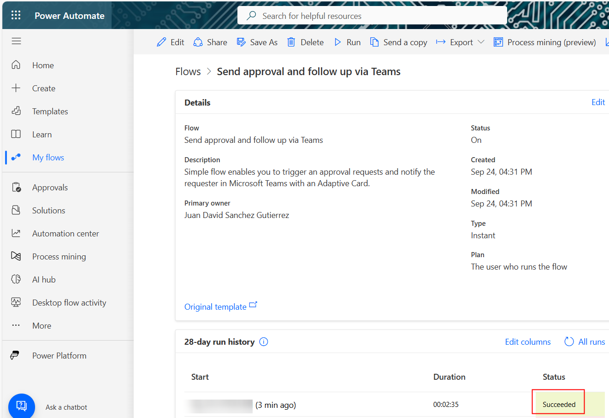
