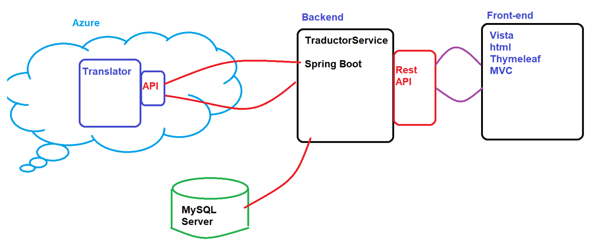

# Ejercicios de análisis de procesos manuales que se pueden automatizar

## Objetivo de la práctica:
Al finalizar la práctica, serás capaz de:
- Identificar qué procesos son viables de automatizar y cuáles no.
- Identificar qué tipo de flujo de Power Automate usar en cada caso de uso

## Objetivo Visual 
Crear un diagrama o imagen que resuma las actividades a realizar, un ejemplo es la siguiente imagen. 

## Duración aproximada:
- 40 minutos.

## Instrucciones 
<!-- Power Automate es una herramienta de la suite de Microsoft que permite crear flujos de trabajo automatizados entre aplicaciones y servicios. Su objetivo principal es reducir tareas repetitivas, mejorar la productividad y facilitar la integración de procesos dentro de la organización. Con Power Automate se pueden crear flujos sencillos, como recibir notificaciones automáticas, hasta procesos más complejos, como aprobaciones, integración con bases de datos o conexión con herramientas externas.

En este laboratorio, realizarás actividades enfocadas en el análisis de procesos manuales para identificar cuáles son viables de automatizar y cuáles requieren necesariamente la intervención humana. A partir de los casos de uso planteados, reflexionarás sobre qué tipo de flujo de Power Automate se debe utilizar en cada situación (por ejemplo, flujos automatizados, instantáneos o programados), reconociendo sus beneficios y limitaciones. -->
### Tarea 1. Descripción de la tarea a realizar.
Paso 1. Debe de relatar el instructor en verbo infinito, claro y conciso cada actividad para ir construyendo paso a paso en el objetivo de la tarea.

Paso 2. <!-- Añadir instrucción -->

Paso 3. <!-- Añadir instrucción -->

### Tarea 2. Descripción de la tarea a realizar.
Paso 1. Debe de relatar el instructor en verbo infinito, claro y conciso cada actividad para ir construyendo paso a paso en el objetivo de la tarea.

Paso 2. <!-- Añadir instrucción -->

Paso 3. <!-- Añadir instrucción -->

### Resultado esperado
En esta sección se debe mostrar el resultado esperado de nuestro laboratorio

