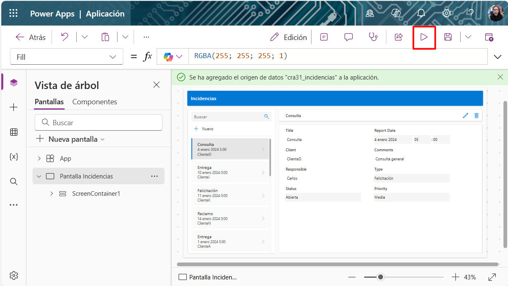
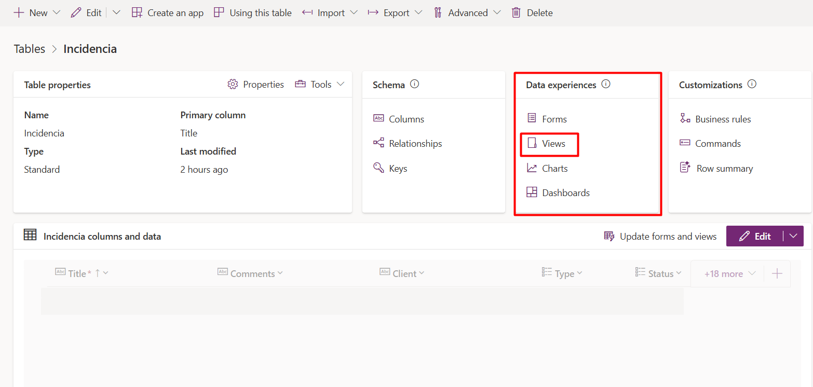
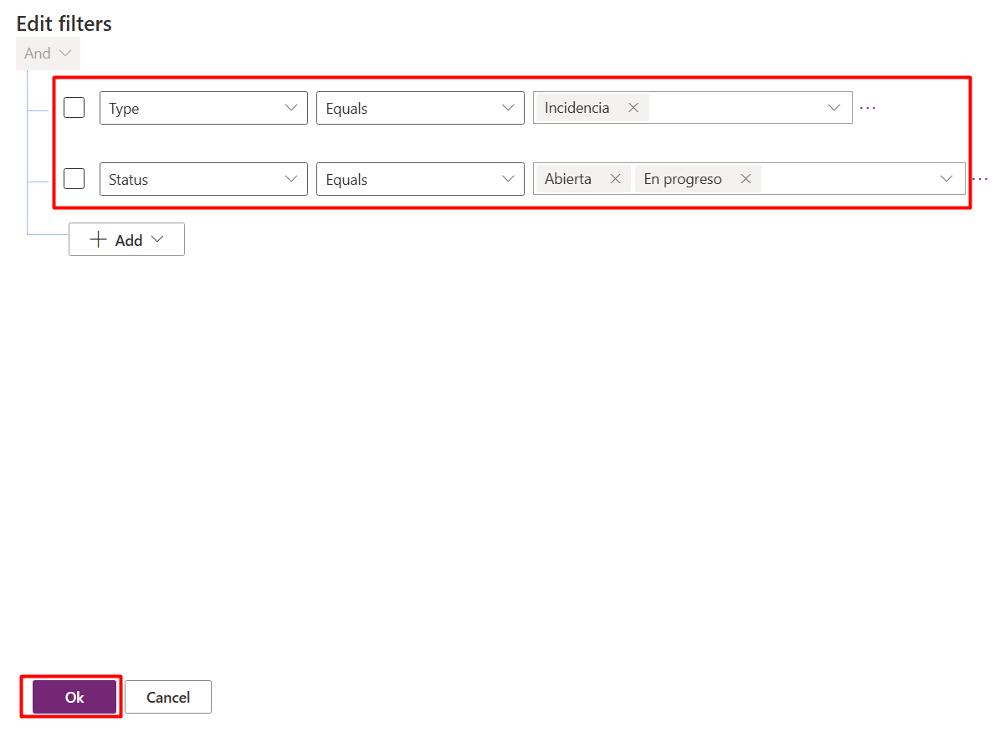

# Creación de una app para gestión de oportunidades incidencias

## Objetivo de la práctica:
Al finalizar la práctica, serás capaz de:
- Crear una aplicación de lienzo desde un origen de datos
- Actualizar la aplicación desde el Power Apps Studio
- Integrar IA a la aplicación.
- Crear una solución y una aplicación Model-driven.

## Diagrama del laboratorio 
El siguiente diagrama resume visualmente lo que realizarás a lo largo de la siguiente práctica. 

## Duración aproximada:
- 60 minutos.

## Instrucciones 
En Power Apps, las aplicaciones de lienzo (canvas apps) pueden crearse a partir de diferentes orígenes de datos, como Dataverse o Excel, lo que permite diseñar experiencias personalizadas según las necesidades del negocio. En Dataverse, además, se pueden crear tablas de manera asistida utilizando Copilot, lo que agiliza la estructuración de la información. Asimismo, es posible complementar estas aplicaciones con una interfaz unificada a través de las aplicaciones basadas en modelos (model-driven apps), logrando una integración más robusta entre datos y procesos.

En el siguiente laboratorio aprenderá a crear una aplicación de lienzo a partir de un origen de datos, actualizarla desde Power Apps Studio, integrar capacidades de IA para analizar los sentimientos en un texto y, finalmente, crear una aplicación basada en modelos (Model-driven app).

### Tarea 1. Haz el modelado de tus datos en Microsoft Dataverse

**Paso 1.** Ingresa a Power Apps

Abre el navegador e ingresa a [Power Apps](https://make.powerapps.com) `https://make.powerapss.com`. Usa las credenciales otordadas por el instructor. Asegurate de seleccionar el entorno **Dev One**, en el costado superior derecho.

---

**Paso 2.** Una vez hayas ingresado a Power Apps debes seleccionar la opción ***Tables*** del menú izquiero, y en la sección ***Tables*** haz clic en ***Get started with Copilot***.

---

**Paso 3.** En la ventana que se abre escribe el siguiente Prompt, que te permitirá crear una tabla con la que diseñarás tu aplicación.

**Prompt:**
`Crea una tabla "Incidencias" que contenga las siguientes columnas: ID, Título (Primary Name), Comentarios, Cliente, Tipo (Tipo Choice: "Felicitación, Incidencia"), Estado (Tipo Choice: "Abierta, En progreso, Cerrada"), Prioridad (Tipo Choice: "Alta", "Media", "Baja"), Fecha del reporte, Responsable.`

Haz clic en el botón **Generate**.

---

**Paso 4.** Verifica que tanto la tabla como las columnas hayan sido creadas correctamente. Fíjate que en el costado derecho permanece una ventana de chat con Copilot, úsala para cualquier modificación que requieras hacer. Además, indícale que agregue 15 registros de ejemplo. En el costado superior verás un botón **View data**, presionalo y mira el resultado.

Cuando estés satisfecho, haz clic en el botón **Save and exit** del costado superior derecho. 

### Tarea 2. Crea tu aplicación de lienzo a partir de un origen de datos

**Paso 1.** Haz regresado a la página principal. En el menú de la izquierda selecciona la opción ***Create***, y luego en la sección **Create your apps** haz clic en ***Start with data***.

---

**Paso 2.** Baja hasta la parte inferior donde dice **Other ways to get started** y selecciona la opción ***Select existing tables***.

---

**Paso 3.** En esta nueva ventana vas a buscar la tabla que creaste en los pasos previos. Haz clic en la pestaña ***Custom*** que esté en el medio, y luego vas a filtrar por el nomnbre que le diste a la tabla: `incidencia`. Seleccionala y haz clic en el botón Create app del costado inferior derecho. 

---

**Paso 4.** Cuando creas una aplicación canvas en Power Apps a partir de un origen de datos, como Dataverse o una tabla en Excel, la plataforma genera automáticamente una aplicación totalmente funcional. Esto significa que no es necesario comenzar desde cero ni configurar cada acción manualmente, ya que la aplicación ya incorpora las operaciones básicas que todo usuario necesita: agregar registros nuevos, modificar los existentes, visualizar la información en detalle y eliminar datos directamente en el origen conectado. De esta manera, se obtiene una solución lista para usarse desde el primer momento, lo que acelera considerablemente el desarrollo.

Además, estas aplicaciones no solo permiten interactuar con los datos de forma inmediata, sino que también proporcionan una experiencia organizada y amigable para el usuario. Los formularios y galerías generados automáticamente muestran la información con un diseño básico, pero funcional, y te ofrecen la posibilidad de personalizar la interfaz según las necesidades de tu negocio. Así, puedes adaptar colores, botones y la navegación, sin perder la funcionalidad estándar que ya incluye la aplicación.

Explora los diferentes componentes, miras las funciones usadas, y de ser necesario solicita a tu instructor una explicación más profunda. 

Finalmente, haz clic en el botón **Ejecutar** que está representado por el triangulo del costado superior derecho. 

---

**Paso 5.** Ahora que has creado tu propia aplicación, es un buen momento para explorarla y familiarizarte con su comportamiento. Por ejemplo, puedes intentar agregar una nueva incidencia y comprobar cómo se guarda directamente en el origen de datos. También puedes modificar un registro existente para verificar que los cambios se actualizan en tiempo real. Otra acción útil es eliminar un dato de prueba y confirmar que desaparece tanto de la aplicación como de la base de datos. Al realizar estas pruebas, verás que, desde el primer momento, tu aplicación no solo está conectada a la información, sino que también está lista para apoyar los procesos de tu organización.

**Paso 6.** Regresa a la vista de edición haciendo clic en la **x** del costado superior derecho.

### Tarea 2. Actualiza tu aplicación agregando Inteligencia Artificial

**Paso 1.** Una vez en la ventana de edición, vamos a agregar Inteligencia Artificial para analizar el sentimiento de quien escribió la incidencia. Recuerda que una incidencia puede ser positiva o negativa, por lo cual necesitamos identificarlo rápidamente.

Para esto Haz clic en la opción **Datos** el ***ícono waffle*** del costado izquierdo, verás que ya tienes como dato de origen la tabla de Dataverse que se creó en la primera tarea. Haz clic en **Agregar datos**, filtra por ***análisis***, y selecciona la opción **Análisis de sentimiento**. Verás que ahora se ha agregado como fuente de datos.

---

**Paso 2.** Ahora vamos a actualizar la aplicación, para ello, vamos a hacer clic en la opción **Insertar** del costado superior, y vamos a seleccionar ***dos Etiquetas de texto***, ***un botón*** y ***un rectangulo***. Edita la posición, el tamaño y las propiedades de texto como se ven en la siguiente imagen.

> [!NOTE]
> Fíjate que una de las dos etiquetas de texto no tiene texto, para esto sólo úbicalo dentro del rectangulo como lo muestra la imagen, cambia el color del texto a blanco y la propiedad texto déjala vacía. 

---

**Paso 3.** Vamos a editar la propiedad ***OnSelect*** del botón, para esto selecciona el botón en el lienzo, y agrega la siguiente función de Power Fx:

**Power Fx:**
`Set(TextInputSentiment; 'Análisis de sentimiento'.Predict(DataCardValue3.Text).Document.TopSentiment);;
IfError(TextInputSentiment; Notify(FirstError.Message;NotificationType.Error))`

> [!IMPORTANT] 
>*  **Set(TextInputSentiment; ...)**
>Crea o actualiza una variable de contexto llamada TextInputSentiment, que almacenará el resultado del análisis de sentimiento.
>*  **'Análisis de sentimiento'.Predict(DataCardValue3.Text)**
> Llama al modelo de AI Builder llamado 'Análisis de sentimiento' para  analizar el texto ingresado en el campo DataCardValue3.
> * **.Document.TopSentiment**
> Extrae el sentimiento principal del documento analizado, como Positivo, Negativo o Neutral.
>*  **IfError(TextInputSentiment; ...)**
> Verifica si ocurrió algún error al intentar establecer la variable TextInputSentiment.
> * **Notify(FirstError.Message; NotificationType.Error)**
> Si hay un error, muestra una notificación en pantalla con el mensaje del primer error detectado. El tipo de notificación es de error, por lo que se muestra en rojo.

---

**Paso 4.** Ahora editremos la propiedad ***Text*** de la etiqueta de texto que habíamos dejado en blanco, para que nos devuelva el nombre del sentimiento encontrado por el modelo de IA. Para ello, seleccionaremos la etiqueta y agregaremos la siguiente función de Power Fx:

**Power Fx** `TextInputSentiment.Name`

### Resultado esperado
El resultado final debería ser el siguiente, al hacer clic en el botón, asegurate de validar que el sentimiento corresponda al comentario del registro, intentalo con varios registros.

Valida el almacenamiento del valor de la variable. Ingresa a la sección ***{x}*** del menú izquierdo, despliega las ***Variables globales***. Valida las definiciones e ingresa a la ***Vista de Registro***, allí se encuentra el último valor almacenado.

¡Felicitaciones!

### Tarea 3. Crear una aplicación Model Driven. 

**Paso 1.** Abre el navegador e ingresa a [Power Apps](https://make.powerapps.com) `https://make.powerapss.com`. Usa las credenciales otordadas por el instructor. Asegurate de seleccionar el entorno **Dev One**, en el costado superior derecho.

--- 

**Paso 2.** En menú del costado izquierdo selecciona la opción ***Tables***. Selecciona la pestaña ***Custom*** en el centro de la página y usa la barra de búsqueda del costado superior derecho para encontrar la tabla ***Incidencia*** que creamos previamente. Haz clic sobre el nombre de la tabla. 

---

**Paso 3.** Un vez dentro de la tabla, dirigete a la sección **Data experiences** y haz clic en la opción **Forms**

---

**Paso 4.** Verás tres tipos de formularios predeterminados, haz clic sobre el nombre ***Information*** del que corresponde al tipo de formulario **Main**.

---

**Paso 5.** El formulario coincide con los datos que necesitarás agregar posteriormente en el laboratorio, por lo cual lo vas a dejar tal cual se encuentra en este momento. Sin embargo, en escenarios reales puedes hacer las modificaciones que desees. 

---

**Paso 6.** Regresa a la ventana de la tabla, haciendo clic en el botón **Back** del costado superior izquierdo, y usando el panel de navegación pasa de los formularios nuevamente a la tabla **Incidencia**. Allí dirígete nuevamente a la sección **Data experiences**, y ahora haz clic sobre **Views**.

---

**Paso 7.** En la vista de **Views** haz clic sobre la vista llamada **Active incidencias**, la tomaremos como base para crear nuestra propia vista. 

---

**Paso 8.** Esta vista tiene todos los datos, sin embargo, no necesitamos todas las columnas, eliminaremos las siguientes: Haz clic en la flecha de cada columna y escoge la opción **Remove**.

* Title
* Type
* Responsible

---

**Paso 9.** Ahora que tenemos únicamente las columnas que necesitamos, vamos a editar los filtros. Haz clic en la opción del costado inferior derecha ***Edit filters...***

---

**Paso 10.** Por defecto la vista de incidencias activas tiene el filtro de ***Status Equals Active***, el cual vamos a eliminar. Al costado derecho haz clic en **(...)** y luego **Delete**.

--- 

**Paso 11.** Ahora agrega una nueva fila, configurada de la siguiente manera: **Type Equals Incidencia**. Y repite el proceso para agregar otra fila configurada así: **Status Equals Abierta** y **En progreso**. Finalmente, haz clic en **Ok**.

---

**Paso 12.** Revisa que el filtro se haya aplicado en tu vista, sólo con las incidencias (sin las felicitaciones) marcadas con el estatus ***Abierta*** o ***En progreso*** 

Ahora sólo queremos organizar por cliente. En el costado inferior derecho, sobre la opción de editar los filtros, haz clic en **Sort by...**, y luego elige Client. 

---

**Paso 13.** Nuestra vista está lista, no hagas clic en el botón ~~Save and publish~~, en lugar de esto, selecciona **Save As** y dale el nombre: `Incidencias abiertas y el progreso`. Finalmente haz clic en el botón **Save**.

---

**Paso 14.** Regresamos a la página principal de la tabla usando el panel de navegación. Ahora, ingresaremos a **Charts** en la sección ***Data experiences***.

---

**Paso 15.** Aquí vamos a hacer clic en **New chart**.

---

**Paso 16.** Configuraremos la gráfica de columnas, por nombre dale `Estatus total de las incidencias`, en **Legend Entries** selecciona `TItle`, y en **Horizontal** selecciona `Status`. 

Finalmente haz clic en el botón **Save and Close** del costado superior. 

---

**Paso 17.** Regresamos a la página principal de la tabla usando el panel de navegación. Ahora, ingresa a la opción **Business Rules** en la sección ***Customizations***.

Dado que no quieres que la fecha de las incidencias sea un valor futuro (por defecto no hay restricciones), crearás una business rule para configurarlo así.

---

**Paso 18.** Hacemos clic en **+ New business rule**, esto abreirá una nueva pestaña en tu navegador. 

---

**Paso 19.** En la interfaz de las Business Rules, configurarás inicialmente la condición. Selecciona la condición representada por el recuadro en el lienzo, esto abrirá el panel de propiedades del lado derecho, donde configurarás los siguientes valores: 

* **Display Name:** `Validar fecha`
* **Rules**:
    * **Field:** `Report Date`
    * **Operator:** `Greater than`
    * **Type:** `field`
    * **Value:** `Vreated On`

Haz clic en el botón **Apply**.

---

**Paso 20.** La condición anterior valida si la fecha ingresada en el campo ***Report Date*** es una fecha futura, ahora configuraremos qué sucederá si esa validación es cierta.

Haz clic en el botón **+Add**, selecciona **Add Show Error Message**, luego selecciona la cruz **+** que está al costado derecho de la condición.

--- 

**Paso 21.** Ahora tienes una acción nueva relacionada al valor **True** de la condición. Selecciona esta nueva acción, esto abrirá el panel de propiedades del costado derecho. Configura los siguientes campos:

* **Display Name:** `Fecha incorrecta`
* **Error Message:**
    * ***Report Date***
    * `La fecha ingresada es incorrecta, intenta nuevamente con una fecha pasada.`

---

**Paso 22.** Ya está lista nueva regla. Haz clic en el botón **Save**, posteriormente **Active** y finalmente, nuevamente en **Active** de la ventana emergente.

---

**Paso 23.** Regresa a la pestaña de Power Apps, haz clic en **Done** en el mensaje emergente que apareció. Ya deberías ver listada tu regla. 

---

**Paso 24.** Una vez en el portal principal, busca la opción **Solutions** en el menú izquierdo, y haz clic sobre este.
Luego selecciona el botón **+New solution**.

---

**Paso 25.** Para la creación de la solución debes agregar los siguientes valores:

* **Display Name:** `NetecSolution`
* **Name:** `NetecSolution` 
* **Publisher:** **+New publisher**

**Pas 26.** En la ventana de creación del ***Publisher***, agrega los siguientes valores:

* **Display Name:** ***Tu nombre***
* **Name:** ***Tu nombre sin espacios***
* **Prefix:** ***las iniciales de tu nombre.*** El prefijo identificará al creador del objeto en Power Platform, por ejemplo, al crear la tabla ***incidencias*** y seleccionar la solución, el nombre quedará con el prefijo del ***Publisher***. ***jdsg_incidencias***.

---

**Paso 27.** Mira que la solución que vas a crear es **no administrada**, eso quiere decir que se encuentra en fase de desarrollo. Haz clic en el botón **Create**.

---

**Paso 28.** La solución es un contenedor lógico que empaquetará objetos de Power Platform.

---

**Paso 29.** En las soluciones puedes agregar objetos existentes, ese será nuestro caso, haz clic en la opción **Add existing** del costado superior, y luego selecciona **Table**.

---

**Paso 30.** Filtra por la tabla que tiene por nombre **incidencia**, y haz clic sobre ella. 

---

**Paso 31.** Desmarca la opción **Include all objects**. Luego haz clic en **Edit objects**

---

**Paso 32.** En la pestaña **Views** selecciona ***Active Incidencias*** y ***Incidencias abiertas y en progreso***.

---

**Paso 33.** En la pestaña **Forms** selecciona ***Information*** que tiene tipo: ***Main***.

---

**Paso 34.** En la pestaña **Charts** selecciona ***Estatus total de incidencias***.

---

**Paso 35.** En la pestaña **Business rules** selecciona ***New business rule***.

Luego haz clic en el botón **Add**

---

**Paso 36.** Revisa que los objetos a importar a la solución sean: ***2 views, 1 form, 1 chart y 1 business rule***, y de ser correcto haz clic en el botón **Add**.

---

**Paso 37.** Una vez importados los objetos de Microsoft Dataverse, crearemos una aplicación Model Driven dentro de la misma solución. Para esto, haz clic en **+ New** del costado superior, y luego **App** y **Model-driven App**.

---

**Paso 38.** En la nueva ventana desplegada ingresa `Incidencias App` como **Name**, y verifica en las opciones avanzadas que se agregará en la solución ***NetecSolution***, que acabamos de crear. Y luego haz clic en **Create**.

---

**Paso 39.** Haz clic en la flecha hacia abajo, que se encuentra en el costado derecho del botón **Add page**, y luego selecciona **Dataverse table**.

---

**Paso 40.** Filtra por el nombre de la tabla `Incidencia`, selecciona la tabla, verifica que esté marcada la opción ***Show in navigation*** y haz clic en el botón **Add**.

---

**Paso 41.** Ya tenemos nuestra aplicación lista. Selecciona el grupo llamado ***New Group***, esto abirá el panel de propiedades. Cambia la opción **Title** del grupo por `Incidencias`.

---

**Paso 42.** Usando los botones del costado superior derecho, publica y luego ejecuta la aplicación.

---

**Paso 43.** ¡Felicitaciones! Haz creado tu aplicación Model Driven.

---

**Paso 44.** Fíjate en las incidencias que están listadas, corresponden a todas las que están almacenadas en Dataverse. Para filtrar por las que están abiertas y en progreso, omitiendo las de felicitación, haz clic en la vista **Active Incidencias** del costado central de la pantalla, y luego selecciona la vista **Incidencias abiertas y en progreso**. Revisa el resultado. 

---

**Paso 45.** Ahora haz clic en la opción **View Chart**. Verifica que la gráfica mostrada sea la que habías creado previamente.

---

**Paso 46.** Ahora ingresarás un nuevo registro. Haz clic en la opción **+ New** del costado superior.

---

**Paso 47.** El formulario para ingresar la nueva incidencia es el mismo que habías visto anteriormente en Dataverse. Ingresa los siguientes datos:

* **Title:** `Incidencia de prueba`
* **Comments:** `Esta es una incidencia de prueba para validar la aplicación`
* **Client:** `Netec`
* **Type:** `Incidencia`
* **Status:** `Abierta`
* **Priority:** `Alta`
* **Report Date:** ***Una fecha futura***
* **Responsable:** ***Tú***

---

**Paso 48.** La Business rule entra en funcionamiento, no te permite agregar una fecha futura. 

---

**Paso 49.** Actualiza la fecha, por una pasada.

---

### Resultado esperado
Deberías ver la incidencia listada en la vista ty aplicación.

