# Práctica 2.1. Creación de una app para gestión de oportunidades incidencias

## Objetivos
Al finalizar la pr√°ctica, ser√°s capaz de:
- Crear una aplicación de lienzo desde un origen de datos.
- Actualizar la aplicación desde el Power Apps Studio.
- Integrar IA a la aplicación.
- Crear una solución y una aplicación Model-driven.

## Duración aproximada
- 60 minutos.

## Objetivo visual

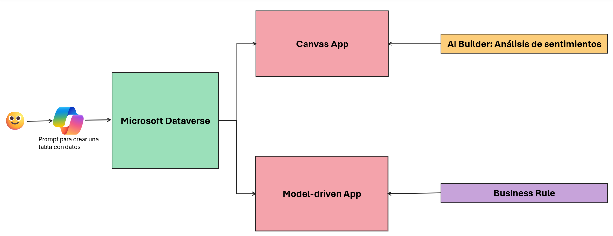

## Instrucciones 
En Power Apps, las aplicaciones de lienzo (canvas apps) pueden crearse a partir de diferentes orígenes de datos, como Dataverse o Excel, lo que permite diseñar experiencias personalizadas según las necesidades del negocio. En Dataverse, además, se pueden crear tablas de manera asistida utilizando Copilot, lo que agiliza la estructuración de la información. Asimismo, es posible complementar estas aplicaciones con una interfaz unificada a través de las aplicaciones basadas en modelos (Model-Driven apps), logrando una integración más robusta entre datos y procesos.

### Tarea 1. Haz el modelado de tus datos en Microsoft Dataverse

**Paso 1.** Ingresa a Power Apps.

Abre el navegador e ingresa a [Power Apps](https://make.powerapps.com) `https://make.powerapss.com` con las credenciales otorgadas por el instructor. Aseg√∫rate de seleccionar el entorno **Dev One**, en el costado superior derecho.

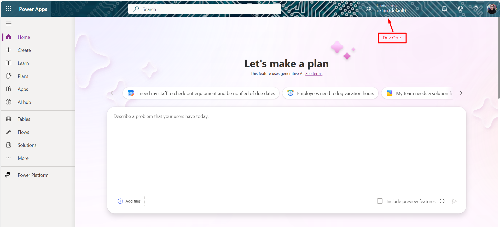

**Paso 2.** Una vez hayas ingresado, debes seleccionar la opción ***Tables*** del menú izquierdo; en la sección ***Tables*** haz clic en ***Get started with Copilot***.

**Paso 3.** En la ventana que se abre, escribe el siguiente _prompt_, que te permitirá crear una tabla con la que diseñarás tu aplicación.

>**Prompt**
>`Crea una tabla "Incidencias" que contenga las siguientes columnas: ID, Título (Primary Name), Comentarios, Cliente, Tipo (Tipo Choice: "Felicitación, Incidencia"), Estado (Tipo Choice: "Abierta, En progreso, Cerrada"), Prioridad (Tipo Choice: "Alta", "Media", "Baja"), Fecha del reporte, Responsable.`

Haz clic en el botón **Generate**.

**Paso 4.** Verifica que tanto la tabla como las columnas hayan sido creadas correctamente. Fíjate que en el costado derecho permanece una ventana de chat con Copilot, úsala para cualquier modificación que requieras hacer. Además, indícale que agregue 15 registros de ejemplo. En el costado superior verás un botón **View data**, presiónalo y mira el resultado.

Cuando estés satisfecho, haz clic en el botón **Save and exit** del costado superior derecho. 

### Tarea 2. Crea tu aplicación de lienzo a partir de un origen de datos

**Paso 1.** Has regresado a la página principal. En el menú de la izquierda, selecciona la opción ***Create*** y luego en la sección **Create your apps** haz clic en ***Start with data***.

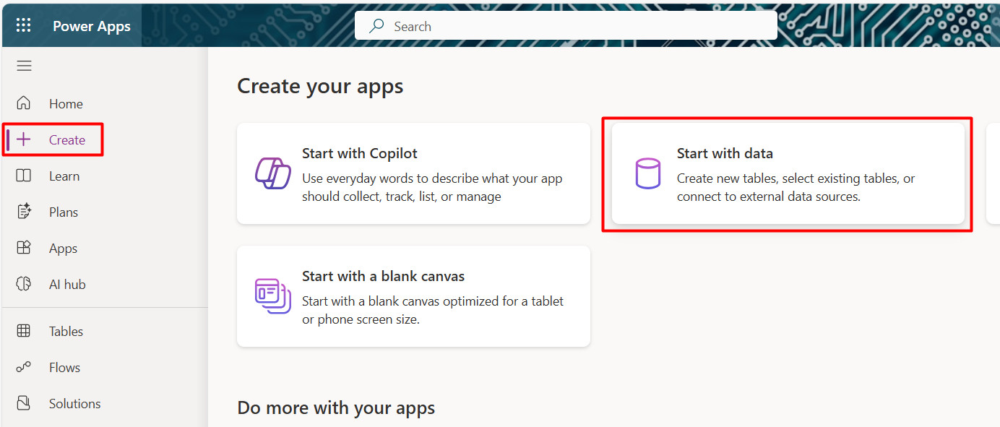

**Paso 2.** Baja hasta la parte inferior donde dice **Other ways to get started** y selecciona la opción ***Select existing tables***.

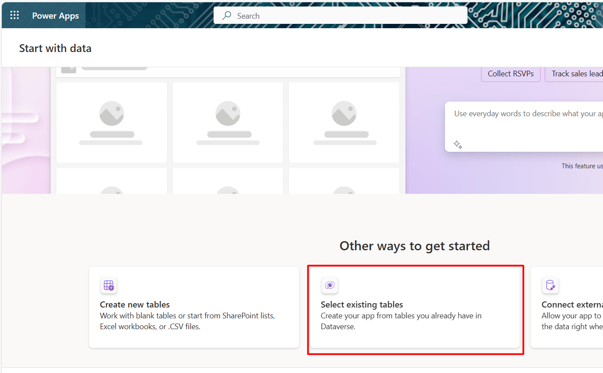

**Paso 3.** En esta nueva ventana, busca la tabla que creaste en los pasos previos. Haz clic en la pestaña ***Custom*** que esté en el medio y, luego, filtra por el nombre que le diste a la tabla: `incidencia`. Seleccionala y haz clic en el botón Create app del costado inferior derecho. 

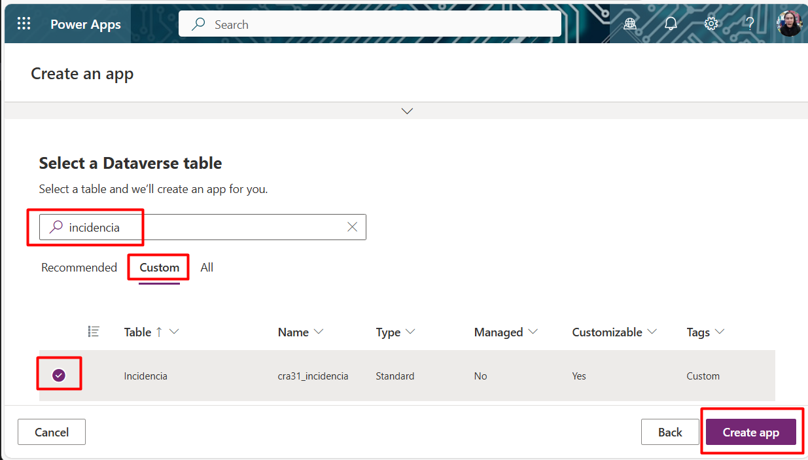

**Paso 4.** Cuando creas una aplicación canvas en Power Apps a partir de un origen de datos, como Dataverse o una tabla en Excel, la plataforma genera automáticamente una aplicación totalmente funcional. Esto permite evitar comenzar desde cero y configurar cada acción manualmente, ya que la aplicación ya incorpora las operaciones básicas que todo usuario necesita: agregar registros nuevos, modificar los existentes, visualizar la información en detalle y eliminar datos directamente en el origen conectado. De esta manera, se obtiene una solución lista para usarse desde el primer momento, lo que acelera considerablemente el desarrollo.

Además, estas aplicaciones no solo permiten interactuar con los datos de forma inmediata, sino que también proporcionan una experiencia organizada y amigable para el usuario. Los formularios y galerías generados automáticamente muestran la información con un diseño básico, pero funcional y te ofrecen la posibilidad de personalizar la interfaz según las necesidades de tu negocio. Así, puedes adaptar colores, botones y la navegación, sin perder la funcionalidad estándar que ya incluye la aplicación.

Explora los diferentes componentes, mira las funciones usadas y, de ser necesario, solicita a tu instructor una explicación más profunda. 

Finalmente, haz clic en el botón **Ejecutar** que está representado por el triangulo del costado superior derecho. 

**Paso 5.** Ahora que has creado tu propia aplicación, es un buen momento para explorarla y familiarizarte con su comportamiento. Por ejemplo, puedes intentar agregar una nueva incidencia y comprobar cómo se guarda directamente en el origen de datos. También puedes modificar un registro existente para verificar que los cambios se actualizan en tiempo real. Otra acción útil es eliminar un dato de prueba y confirmar que desaparece tanto de la aplicación como de la base de datos. Al realizar estas pruebas, verás que, desde el primer momento, tu aplicación no solo está conectada a la información, sino que también está lista para apoyar los procesos de tu organización.

**Paso 6.** Regresa a la vista de edición haciendo clic en la **_x_** del costado superior derecho.

### Tarea 2. Actualiza tu aplicación agregando inteligencia artificial

**Paso 1.** Una vez en la ventana de edición, agrega funciones de inteligencia artificial para analizar el sentimiento de quien escribió la incidencia. Recuerda que una incidencia puede ser positiva o negativa, por lo que necesitas identificarlo rápidamente.

Para esto, haz clic en la opción **Datos** el ***ícono waffle*** del costado izquierdo, verás que ya tienes como dato de origen la tabla de Dataverse que se creó en la primera tarea. Haz clic en **Agregar datos**, filtra por ***análisis*** y selecciona la opción **Análisis de sentimiento**. Verás que ahora se ha agregado como fuente de datos.

**Paso 2.** Ahora, actualiza la aplicación, para ello, haz clic en la opción **Insertar** del costado superior y selecciona ***dos Etiquetas de texto***, ***un botón*** y ***un rectángulo***. Edita la posición, el tamaño y las propiedades de texto como se ven en la siguiente imagen.

> 💡 **Nota:** Fíjate que una de las dos etiquetas de texto no tiene texto, para esto solo úbicalo dentro del rectángulo como lo muestra la imagen, cambia el color del texto a blanco y la propiedad _Texto_ déjala vacía. 

**Paso 3.** Edita la propiedad ***OnSelect*** del botón. Para esto, selecciona el botón en el lienzo y agrega la siguiente función de Power Fx.

**Power Fx**
`Set(TextInputSentiment; 'An√°lisis de sentimiento'.Predict(DataCardValue3.Text).Document.TopSentiment);;
IfError(TextInputSentiment; Notify(FirstError.Message;NotificationType.Error))`

> ‚ùó**Importante**
>*  **`Set(TextInputSentiment; ...)`**
> Crea o actualiza una variable de contexto llamada `TextInputSentiment`, que almacenar√° el resultado del an√°lisis de sentimiento.
>*  **'An√°lisis de sentimiento'. `Predict(DataCardValue3.Text)`**
> Llama al modelo de AI Builder llamado 'An√°lisis de sentimiento' para  analizar el texto ingresado en el campo DataCardValue3.
> * **`.Document.TopSentiment`**
> Extrae el sentimiento principal del documento analizado, como positivo, negativo o neutral.
>*  **`IfError(TextInputSentiment; ...)`**
> Verifica si ocurrió algún error al intentar establecer la variable `TextInputSentiment`.
> * **`Notify(FirstError.Message; NotificationType.Error)`**
> Si hay un error, muestra una notificación en pantalla con el mensaje del primer error detectado. El tipo de notificación es de error, por lo que se muestra en rojo.

**Paso 4.** Ahora, edita la propiedad ***Text*** de la etiqueta que dejaste en blanco, para que devuelva el nombre del sentimiento encontrado por el modelo de IA. Para ello, selecciona la etiqueta y agrega la siguiente función de Power Fx.

**Power Fx** `TextInputSentiment.Name`

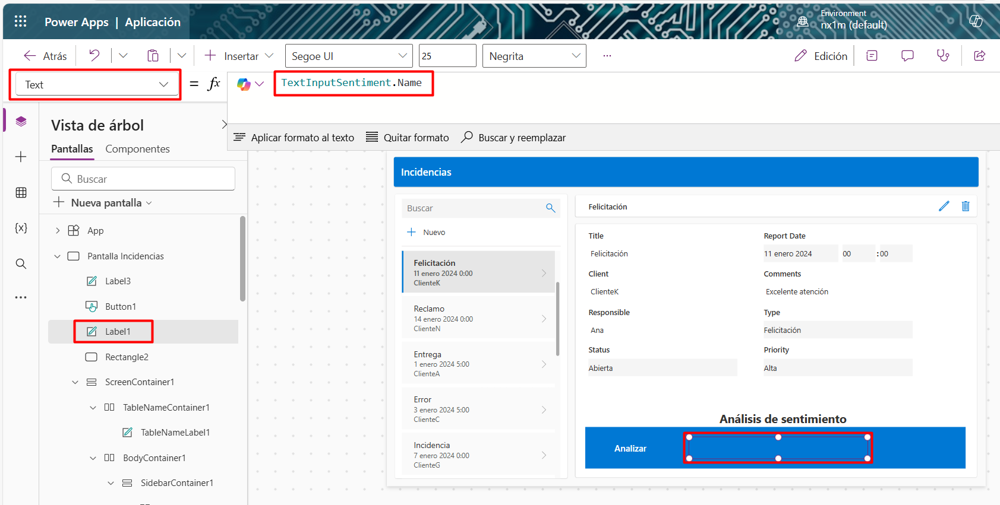

### Resultado esperado
El resultado final debería ser el siguiente. Al hacer clic en el botón, asegúrate de validar que el sentimiento corresponda al comentario del registro, inténtalo con varios registros.

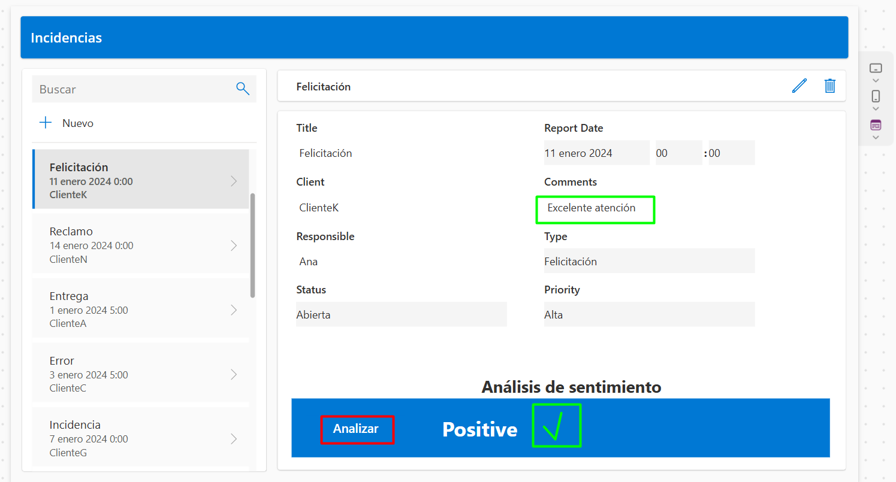

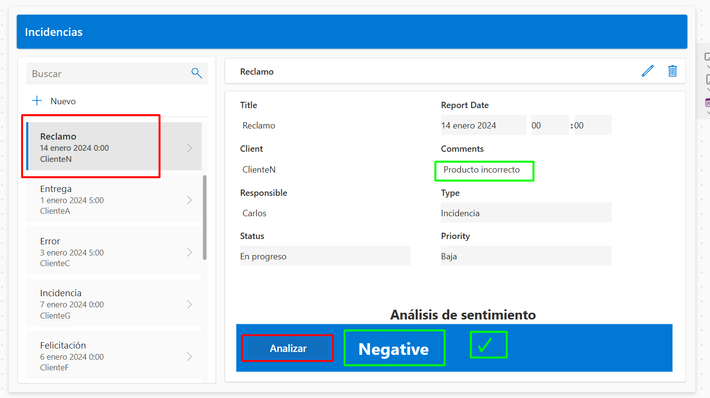

Valida el almacenamiento del valor de la variable. Ingresa a la sección ***{x}*** del menú izquierdo, despliega las ***Variables globales***. Valida las definiciones e ingresa a la ***Vista de Registro***, allí se encuentra el último valor almacenado.

¬°Felicitaciones!

### Tarea 3. Crear una aplicación Model Driven

**Paso 1.** Abre el navegador e ingresa a [Power Apps](https://make.powerapps.com) `https://make.powerapps.com` con las credenciales otorgadas por el instructor. Aseg√∫rate de seleccionar el entorno **Dev One** en el costado superior derecho.

**Paso 2.** En menú del costado izquierdo, selecciona la opción ***Tables***. Selecciona la pestaña ***Custom*** en el centro de la página y usa la barra de búsqueda del costado superior derecho para encontrar la tabla ***Incidencia*** que creaste previamente. Haz clic sobre el nombre de la tabla. 

**Paso 3.** Un vez dentro de la tabla, dirígete a la sección **Data experiences** y haz clic en la opción **Forms**.

**Paso 4.** Ver√°s tres tipos de formularios predeterminados, haz clic sobre el nombre ***Information*** del que corresponde al tipo de formulario **Main**.

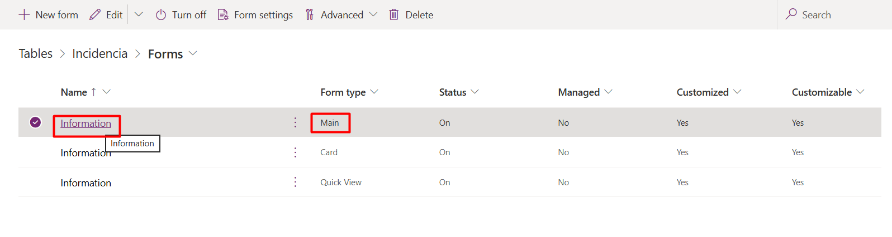

**Paso 5.** El formulario coincide con los datos que necesitar√°s agregar posteriormente en el laboratorio, por lo que lo dejar√°s tal cual se encuentra en este momento. Sin embargo, en escenarios reales, puedes hacer las modificaciones que desees. 

**Paso 6.** Regresa a la ventana de la tabla, haz clic en el botón **_Back_** del costado superior izquierdo y usa el panel de navegación para pasar de los formularios nuevamente a la tabla **_Incidencia_**. Allí dirígete nuevamente a la sección **_Data experiences_** y, ahora, haz clic sobre **_Views_**.

**Paso 7.** En la vista de **_Views_**, haz clic sobre la vista **_Active Incidencias_**, la cual tomar√°s como base para crear tu propia vista. 

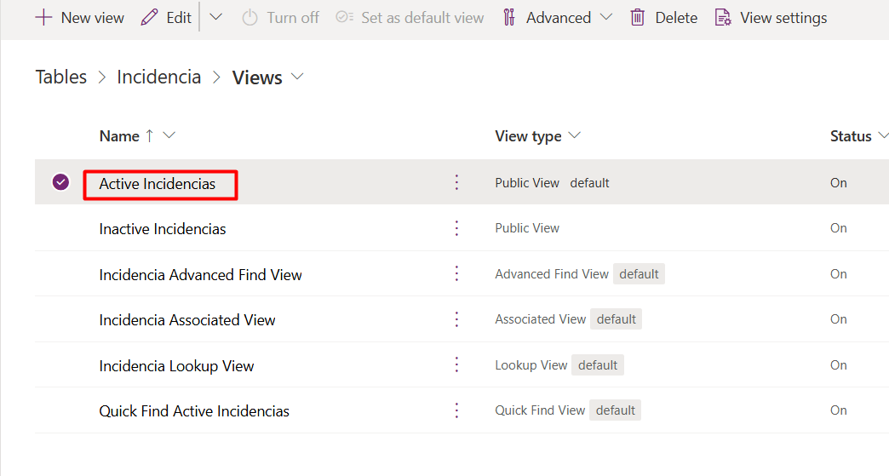

**Paso 8.** Esta vista tiene todos los datos, sin embargo, no necesitas todas las columnas, elimina las siguientes haciendo clic en la flecha de cada columna y escogiendo la opción **Remove**.

* Title
* Type
* Responsible

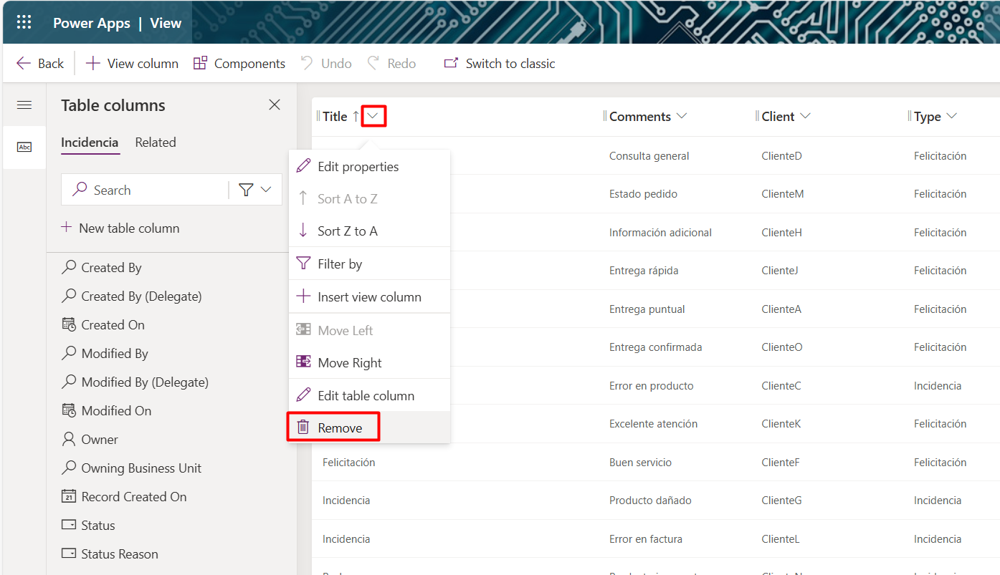

**Paso 9.** Ahora que tienes únicamente las columnas que necesitas, edita los filtros. Haz clic en la opción del costado inferior derecha ***Edit filters...***

**Paso 10.** Por defecto, la vista de incidencias activas tiene el filtro de ***Status Equals Active***, el cual debes eliminar. Al costado derecho, haz clic en **(...)** y luego **Delete**.

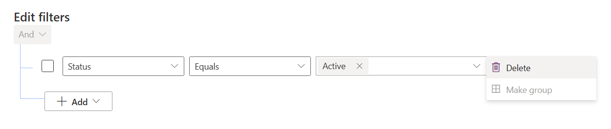

 

**Paso 11.** Ahora, agrega una nueva fila, configurada de la siguiente manera: **_Type Equals Incidencia_** y repite el proceso para agregar otra fila configurada así: **_Status Equals Abierta_** y **_En progreso_**. Finalmente, haz clic en **_Ok_**.

**Paso 12.** Revisa que el filtro se haya aplicado en tu vista, solo con las incidencias (sin las felicitaciones) marcadas con el estatus **_Abierta_** o **_En progreso_**

Ahora, organiza por cliente. En el costado inferior derecho, sobre la opción de editar los filtros, haz clic en **_Sort by..._** y luego elige **_Client_**. 

**Paso 13.** La vista está lista. **No** hagas clic en el botón **_Save and publish_**, sino selecciona **_Save As_** y nómbralo: `Incidencias abiertas y el progreso`. Finalmente, haz clic en el botón **Save**.

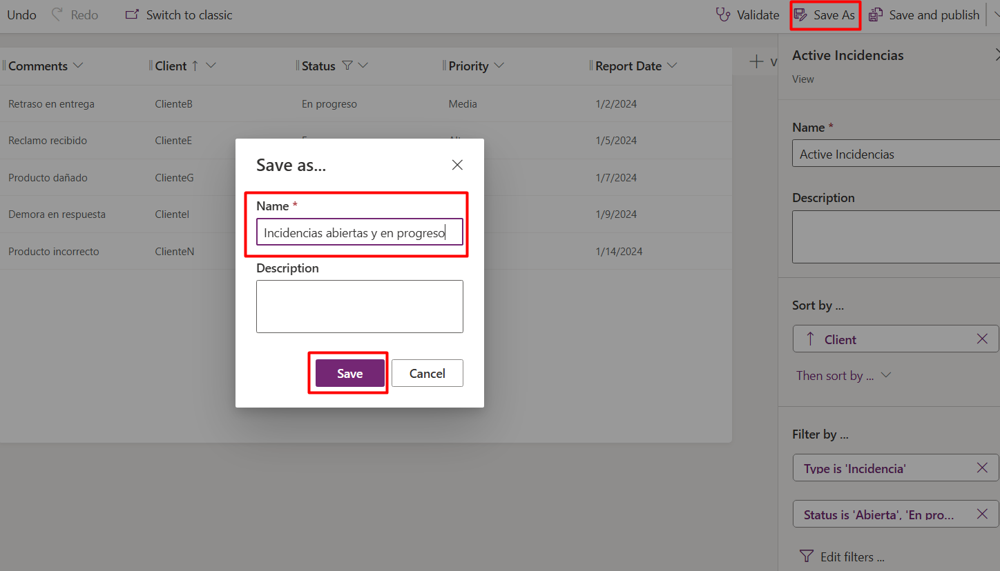

**Paso 14.** Regresa a la página principal de la tabla usando el panel de navegación. Ahora, ingresa a **Charts** en la sección ***Data experiences***.

**Paso 15.** Aquí, haz clic en **_New chart_**.

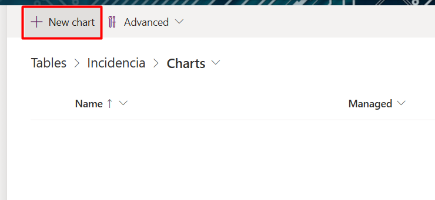

**Paso 16.** Configura la gráfica de columnas, nómbrala `Estatus total de las incidencias`, en **_Legend Entries_** selecciona `Title` y en **_Horizontal_** selecciona `Status`. 

Finalmente, haz clic en el botón **Save and Close** del costado superior. 

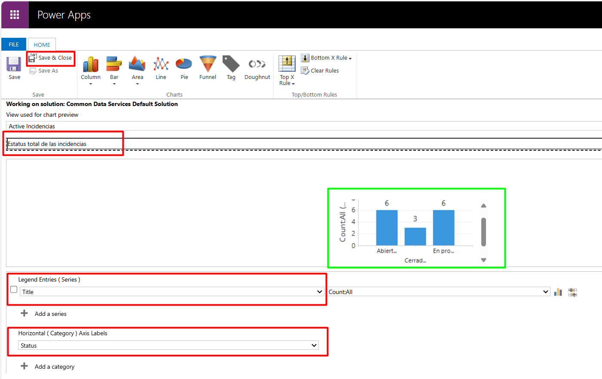

**Paso 17.** Regresa a la página principal de la tabla usando el panel de navegación. Ahora, ingresa a la opción **_Business Rules_** en la sección ***Customizations***.

Dado que no quieres que la fecha de las incidencias sea un valor futuro (por defecto, no hay restricciones), crear√°s una _business rule_ para configurarlo.

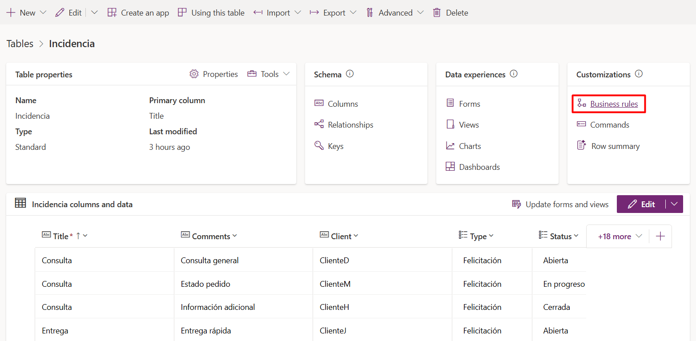

**Paso 18.** Haz clic en **_+ New business rule_**, esto abrirá una nueva pestaña en tu navegador. 

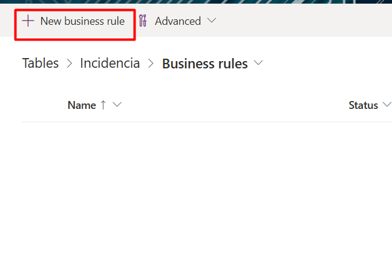

**Paso 19.** En la interfaz de las **_Business Rules_**, configurarás inicialmente la condición. Selecciona la condición representada por el recuadro en el lienzo, esto abrirá el panel de propiedades del lado derecho, donde configurarás los siguientes valores.

* **Display Name:** `Validar fecha`
* **Rules**:
    * **Field:** `Report Date`
    * **Operator:** `Greater than`
    * **Type:** `Field`
    * **Value:** `Created On`

Haz clic en el botón **_Apply_**.

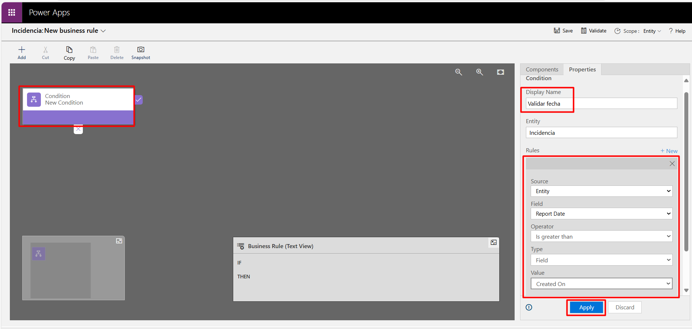

**Paso 20.** La condición anterior valida si la fecha ingresada en el campo ***Report Date*** es una fecha futura. Ahora, configura qué sucede si esa validación es cierta.

Haz clic en el botón **_+Add_**, selecciona **_Add Show Error Message_**; luego, selecciona la cruz **_+_** que está al costado derecho de la condición.

 

**Paso 21.** Ahora, tienes una acción nueva relacionada al valor **_True_** de la condición. Selecciona esta nueva acción, esto abrirá el panel de propiedades del costado derecho. 
Configura los siguientes campos:

* **Display Name:** `Fecha incorrecta`
* **Error Message:**
    * ***Report Date***
    * `La fecha ingresada es incorrecta, intenta nuevamente con una fecha pasada.`

**Paso 22.** Ya está lista nueva regla. Haz clic en el botón **_Save_**, posteriormente, **_Active_** y, finalmente, otra vez en **_Active_** de la ventana emergente.

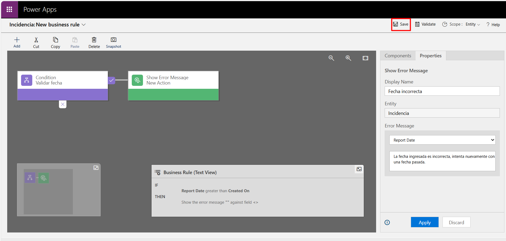
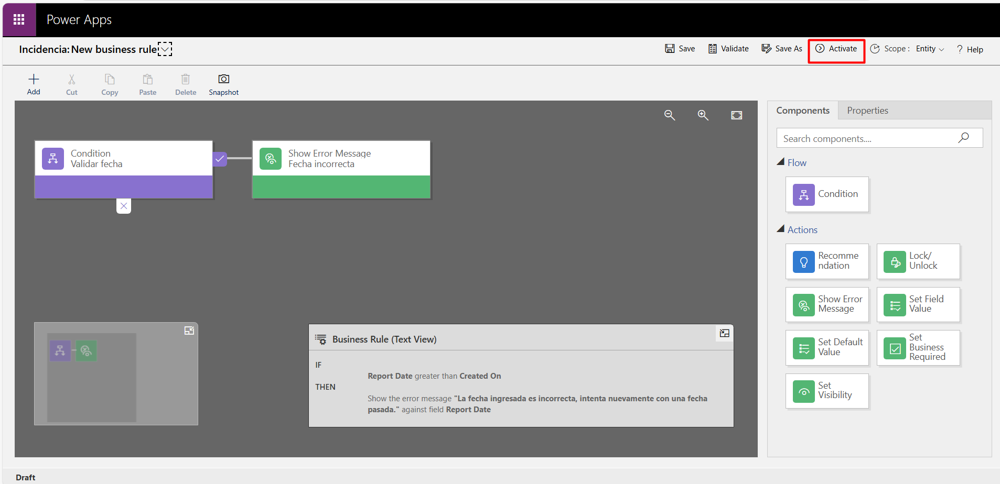
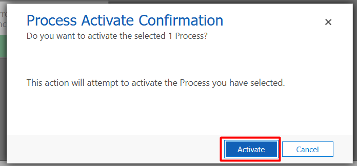

**Paso 23.** Regresa a la pestaña de Power Apps, haz clic en **_Done_** en el mensaje emergente que apareció. Ya deberías ver enlistada tu regla. 

**Paso 24.** Una vez en el portal principal, busca la opción **_Solutions_** en el menú izquierdo y haz clic sobre este.
Luego selecciona el botón **_+New solution_**.

**Paso 25.** Para la creación de la solución debes agregar los siguientes valores:

* **Display Name:** `NetecSolution`
* **Name:** `NetecSolution` 
* **Publisher:** **+New publisher**

**Paso 26.** En la ventana de creación del ***Publisher***, agrega los siguientes valores:

* **Display Name:** ***Tu nombre***
* **Name:** ***Tu nombre sin espacios***
* **Prefix:** ***las iniciales de tu nombre.*** El prefijo identificará al creador del objeto en Power Platform, por ejemplo, al crear la tabla ***incidencias*** y seleccionar la solución, el nombre quedará con el prefijo del ***Publisher***. ***jdsg_incidencias***.

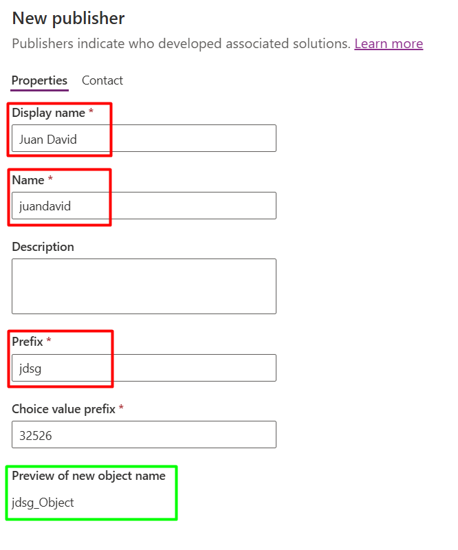

**Paso 27.** Observa que la solución que crearás es **no administrada**, eso quiere decir que se encuentra en fase de desarrollo. Haz clic en el botón **_Create_**.

**Paso 28.** La solución es un contenedor lógico que empaquete objetos de Power Platform.

**Paso 29.** En las soluciones, puedes agregar objetos existentes; para ello, haz clic en la opción **_Add existing_** del costado superior y luego selecciona **_Table_**.

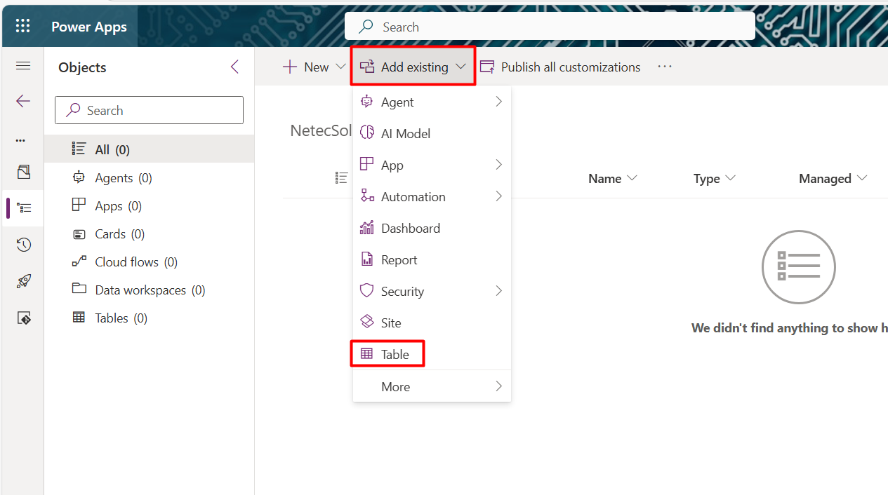

**Paso 30.** Filtra por la tabla que tiene por nombre **_Incidencia_** y haz clic en ella. 

**Paso 31.** Desmarca la opción **_Include all objects_**. Luego, haz clic en **_Edit objects_**.

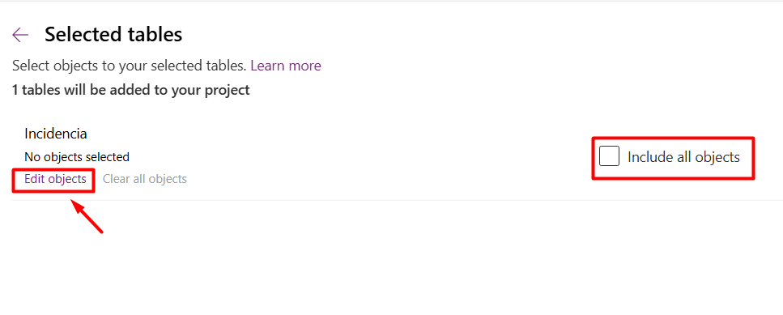

**Paso 32.** En la pestaña **_Views_**, selecciona ***Active Incidencias*** y ***Incidencias abiertas y en progreso***.

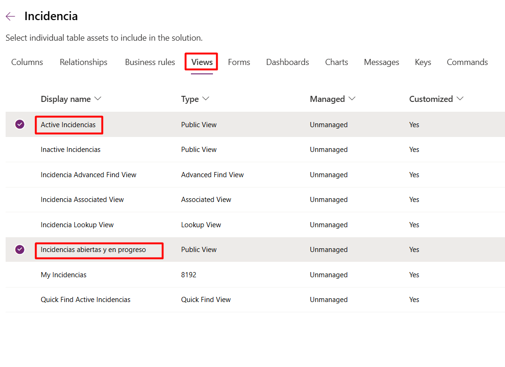

**Paso 33.** En la pestaña **_Forms_**, selecciona ***Information*** que tiene tipo ***Main***.

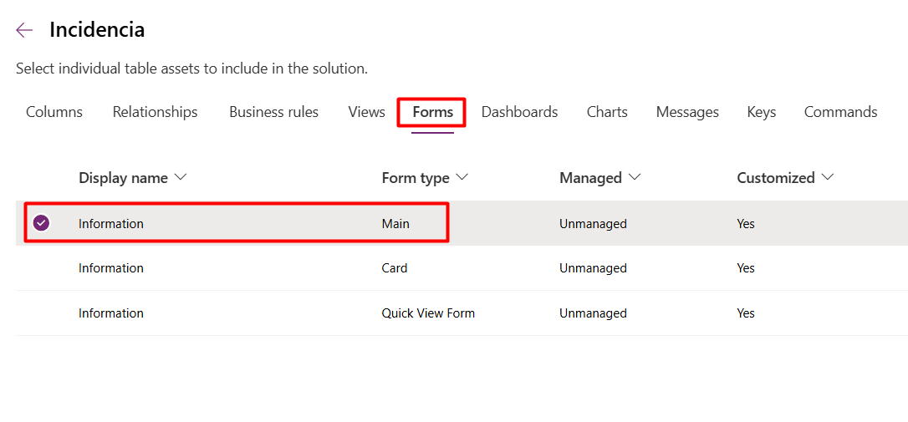

**Paso 34.** En la pestaña **_Charts_**, selecciona ***Estatus total de incidencias***.

**Paso 35.** En la pestaña **_Business rules_**, selecciona ***New business rule***.

Luego, haz clic en el botón **_Add_**.

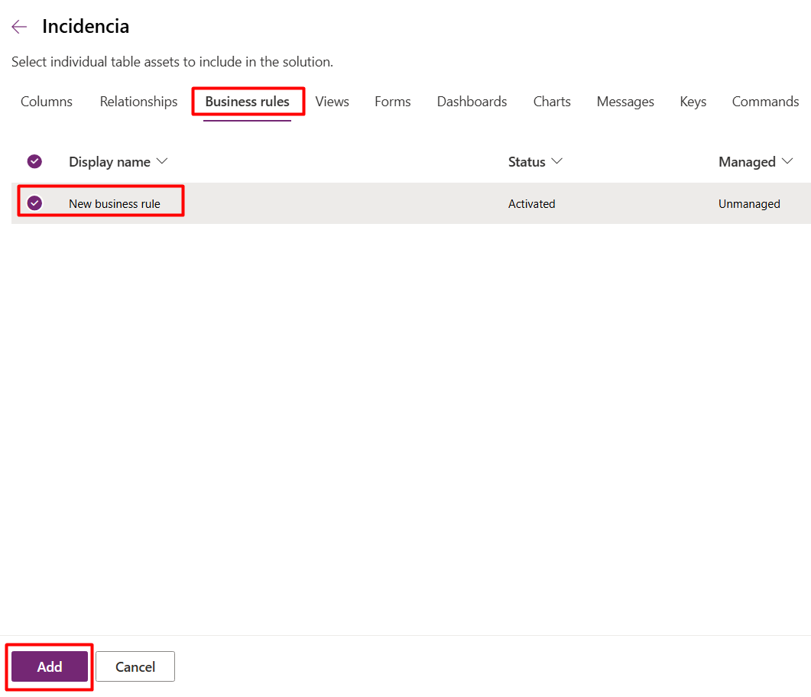

**Paso 36.** Revisa que los objetos a importar a la solución sean: ***2 views, 1 form, 1 chart y 1 business rule*** y, de ser correcto, haz clic en el botón **_Add_**.

**Paso 37.** Una vez importados los objetos de Microsoft Dataverse, crea una aplicación Model Driven dentro de la misma solución. Para esto, haz clic en **_+ New_** del costado superior y luego **_App_** y **_Model-Driven App_**.

**Paso 38.** En la nueva ventana desplegada, ingresa `Incidencias App` como **_Name_** y verifica en las opciones avanzadas que se agrega en la solución ***NetecSolution***, que acabas de crear. Luego, haz clic en **_Create_**.

**Paso 39.** Haz clic en la flecha hacia abajo, que se encuentra en el costado derecho del botón **Add page** y luego selecciona **Dataverse table**.

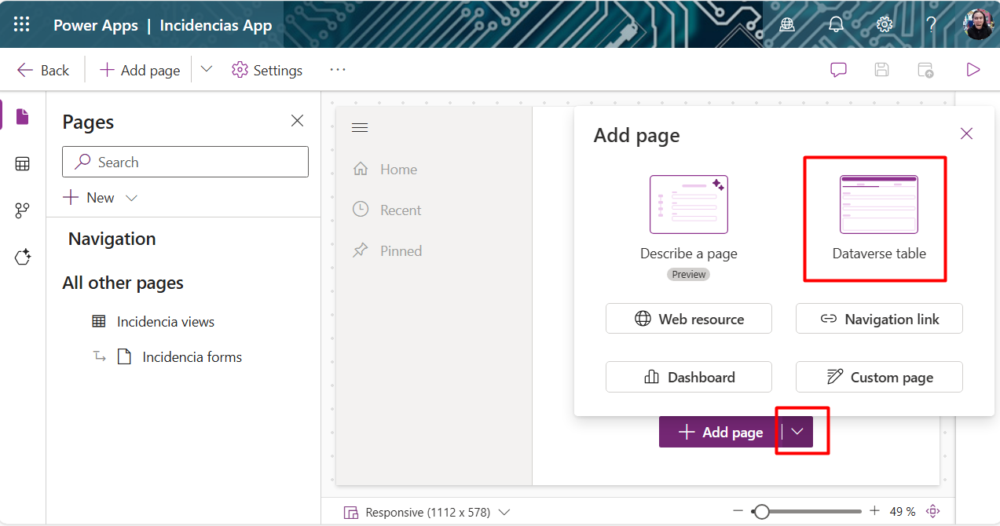

**Paso 40.** Filtra por el nombre de la tabla `Incidencia`, selecciona la tabla, verifica que esté marcada la opción ***Show in navigation*** y haz clic en el botón **Add**.

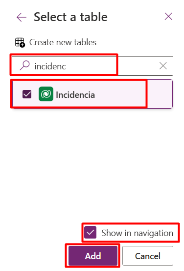

**Paso 41.** Ya tienes la aplicación lista. Selecciona el grupo llamado ***New Group***, esto abrirá el panel de propiedades. Cambia la opción **_Title_** del grupo por `Incidencias`.

**Paso 42.** Usando los botones del costado superior derecho, publica y luego ejecuta la aplicación.

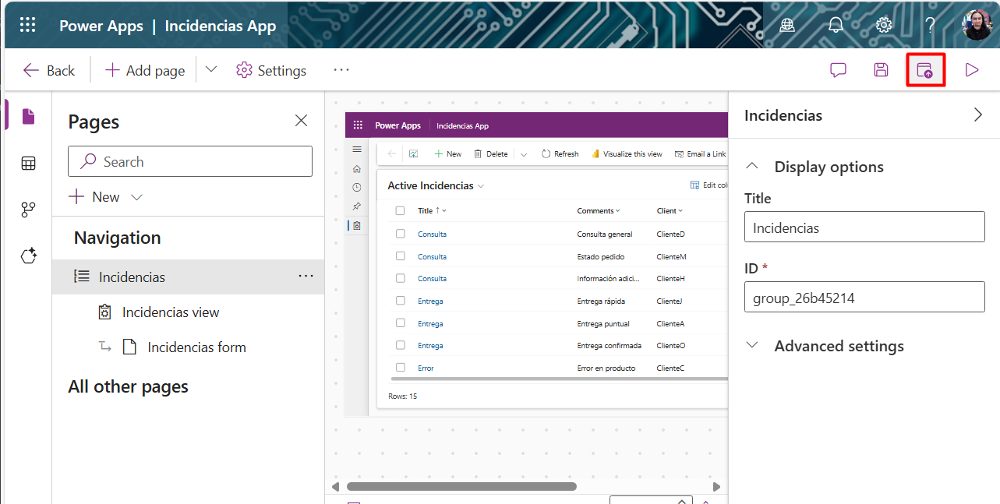
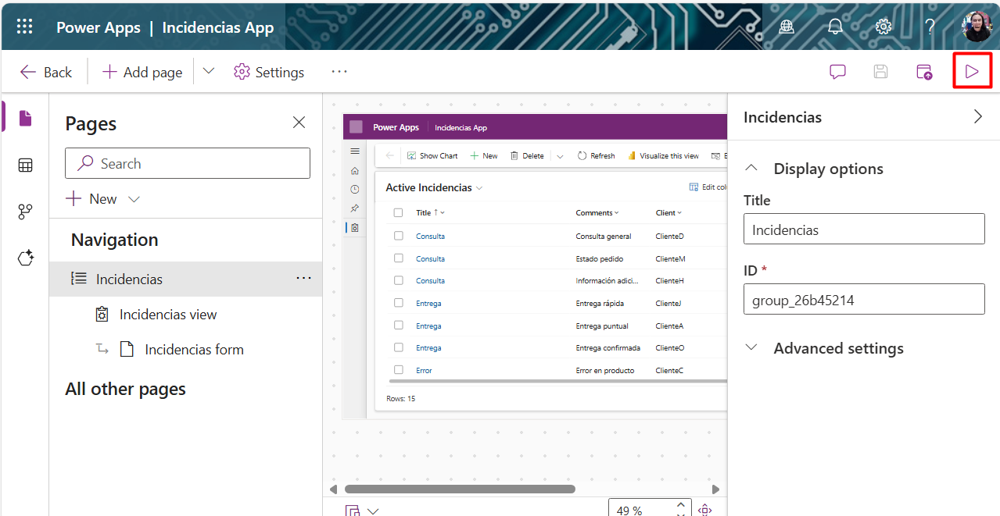

**Paso 43.** ¡Felicitaciones! Haz creado tu aplicación Model Driven.

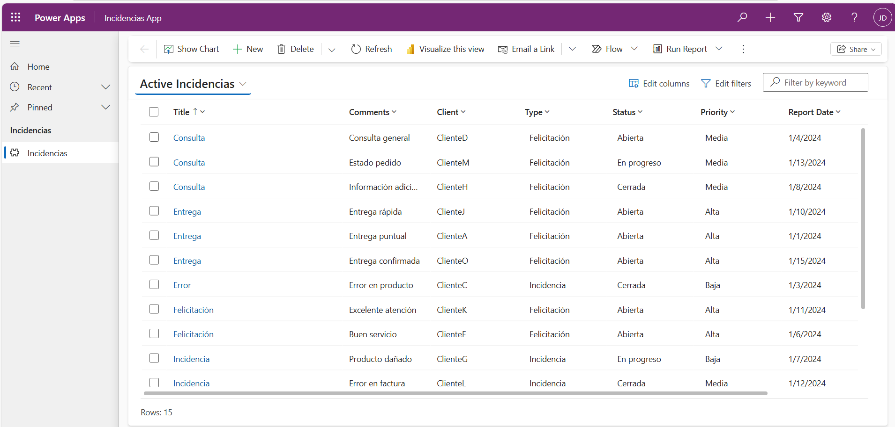

**Paso 44.** Fíjate en las incidencias que están listadas, corresponden a todas las almacenadas en Dataverse. Para filtrar por las que están abiertas y en progreso, omitiendo las de felicitación, haz clic en la vista **_Active Incidencias_** del costado central de la pantalla y, luego, selecciona la vista **_Incidencias abiertas y en progreso_**. Revisa el resultado. 

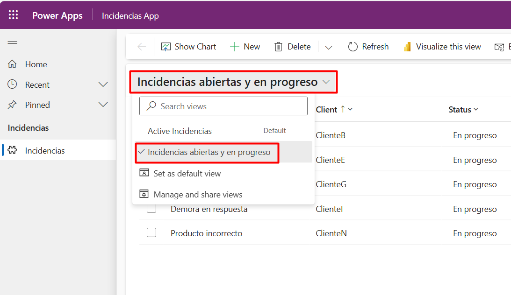

**Paso 45.** Ahora haz clic en la opción **View Chart**. Verifica que la gráfica mostrada sea la que habías creado previamente.

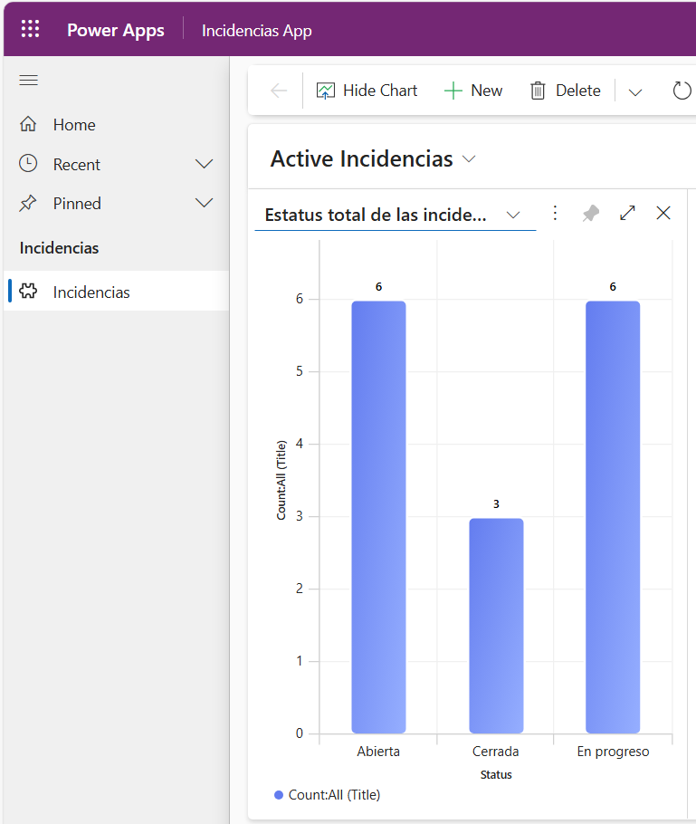

**Paso 46.** Ahora, ingresa un nuevo registro. Haz clic en la opción **+ New** del costado superior.

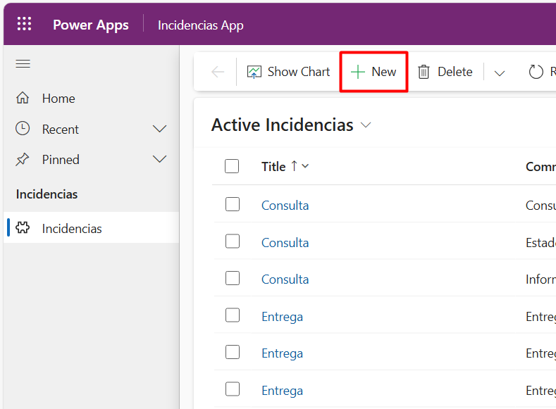

**Paso 47.** El formulario para ingresar la nueva incidencia es el mismo que habías visto anteriormente en Dataverse. 
Ingresa los siguientes datos:
* **Title:** `Incidencia de prueba`.
* **Comments:** `Esta es una incidencia de prueba para validar la aplicación`.
* **Client:** `Netec`.
* **Type:** `Incidencia`.
* **Status:** `Abierta`.
* **Priority:** `Alta`.
* **Report Date:** ***Una fecha futura***.
* **Responsable:** ***T√∫***.

**Paso 48.** La _Business rule_ entra en funcionamiento, no te permitir√° agregar una fecha futura. 

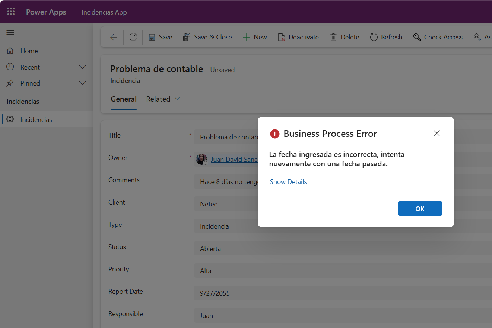

**Paso 49.** Actualiza la fecha por una pasada.

### Resultado esperado
Debes ver la incidencia listada en la vista y la aplicación.

